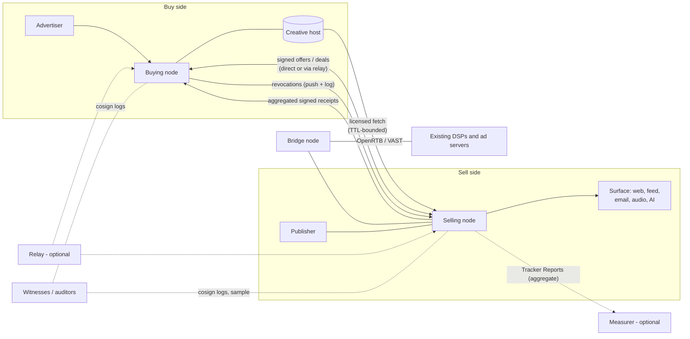
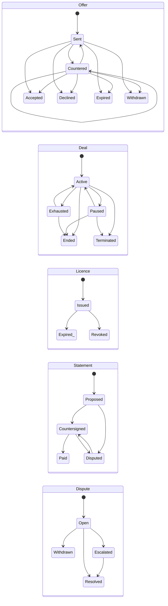
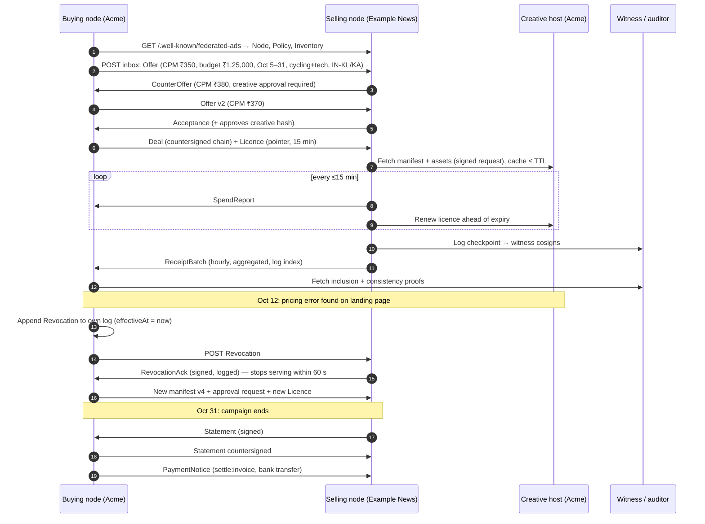

# The Federated Ads Protocol

### An open, federated, owner-controlled protocol for advertising on the open web

**Whitepaper · Version 0.3 · Draft for public comment · 5 October 2026**

| | |
|---|---|
| **Short name** | Federated Ads (identifier: `federated-ads`) |
| **Published by** | The Federated Ads Initiative (see [§23](#23-governance-ipr-and-funding) for what this is today) |
| **Contributors** | Suneesh Rajan; Arjun Krishna; Claude (Anthropic) |
| **Contact** | Suneesh Rajan · suneeshtr@gmail.com |
| **Repository and issues** | https://github.com/federated-ads/spec |
| **Namespace (provisional)** | `https://w3id.org/federated-ads/v0` |
| **Licence** | Text: CC BY 4.0. Reference code: Apache-2.0. Contributor patent commitment: see [§23.4](#234-intellectual-property) |
| **Status** | Discussion document. Not a standard, and not endorsed by any standards body. The normative protocol text is maintained separately as an Internet-Draft (`draft-rajan-federated-ads-protocol`). |

> **Authored with Claude.** This whitepaper was researched, structured and drafted with Claude, an AI model made by Anthropic, under the direction of a human contributor who set its goals, made every design decision, and is accountable for its contents. Research findings were gathered with AI-assisted web research and should be independently checked; items resting on secondary sources are flagged. See [§28](#28-ai-assistance-disclosure).

> **Naming note.** This project is unrelated to The Trade Desk's "OpenAds" header-bidding wrapper (announced October 2025), to the blockchain project "Open Ads Protocol", and to the historical "Openads" ad server (later OpenX/Revive). Version 0.1 of this paper used the working name "OpenAds"; it was renamed to avoid confusion.

---

## Executive summary

**The problem.** Digital advertising pays for much of the open internet, but the system that delivers it is concentrated, opaque and built on tracking people.

- The ten largest US ad sellers now take **84.1%** of US internet ad revenue, up from 78.6% in 2021 [5].
- Outside China, Alphabet, Meta and Amazon take **57.6%** of all advertising revenue [6].
- A US federal court and the European Commission have both found that Google abused its position in ad tech [7][8].
- The ANA's benchmark finds that a large share of programmatic spend still fails to become effective, viewable, valid impressions [4].
- About **1.1 billion people**, roughly 30% of internet users, block ads [11].

Meanwhile, the publishers who most need a fair way to earn have no neutral, interoperable option. That includes independent sites, newsletters, podcasts, fediverse communities and now AI assistants.

**The proposal.** The Federated Ads Protocol ("Federated Ads") is an open protocol, in the tradition of email and ActivityPub, that lets independent servers ("nodes") run by publishers, advertisers, agencies or cooperatives:

1. **find each other** by domain;
2. **agree deals** with signed offers;
3. **serve creatives the advertiser still owns and can withdraw at any time**, under a time-limited licence;
4. **prove delivery** with signed, aggregated receipts recorded in tamper-evident logs;
5. **settle payment** on whatever payment rail the parties choose.

Matching is **contextual by default**, so the protocol carries no cross-site identifiers. People who see ads get enforceable rights: an explanation, an opt-out, an ad-free option and a way to report abuse. One protocol covers websites, fediverse and social feeds, newsletters, podcasts and AI/chat surfaces.

Third parties can **measure** but not **track**. Verification and reporting vendors receive signed, aggregate measurements about a deal, never observations about a person ([§10.9](#109-third-party-measurement-and-tracking), [§14.3](#143-bridges)). Attribution is limited to deal-level counts, experiments and a planned aggregate conversion profile.

**What is new.** Most pieces exist separately: domain-bound signing (DKIM, ads.cert), contextual networks (EthicalAds), on-device matching (Brave), transparency logs (Certificate Transparency). Federated Ads combines them into one open protocol with four properties that, as far as our search found, no current system offers together ([§2](#2-what-has-been-tried-lessons-from-prior-art)):

- parties find each other by domain, with no central exchange, and choose their own intermediaries;
- the advertiser keeps ownership of its creative, and recipients must acknowledge its revocation;
- delivery records are signed and logged, so others can check them;
- matching is contextual by default.

**What this paper is honest about.** Federated Ads will not offer cross-publisher reach-and-frequency planning, and that is by design. Its verification is weaker than incumbent verification vendors for anonymous, high-value deals until independent auditors and client attestation mature. It also faces a hard cold-start problem. [§20](#20-economics-a-worked-example), [§22](#22-adoption-strategy) and [§25](#25-risks-and-mitigations) address these directly.

**What we are asking for.** Review and criticism from standards bodies (W3C, IETF, IAB Tech Lab), from publishers and advertisers, and from civil society. Specifically:
- Is the problem framed correctly?
- Are the trade-offs acceptable?
- Would you implement, pilot or govern this?

---

## Contents

**Part I: Why**
1. [The problem](#1-the-problem)
2. [What has been tried: lessons from prior art](#2-what-has-been-tried-lessons-from-prior-art)

**Part II: What**
3. [Vision, principles, goals and non-goals](#3-vision-principles-goals-and-non-goals)
4. [Actors and roles](#4-actors-and-roles)
5. [Architecture](#5-architecture)
6. [Market design: how buying and selling works](#6-market-design-how-buying-and-selling-works)
7. [Creative ownership, licensing and revocation](#7-creative-ownership-licensing-and-revocation)
8. [Audience matching: options compared](#8-audience-matching-options-compared)
9. [Brand safety and content policy: options compared](#9-brand-safety-and-content-policy-options-compared)
10. [Measurement and verification](#10-measurement-and-verification)
11. [Settlement](#11-settlement)
12. [End-user rights](#12-end-user-rights)
13. [Surfaces](#13-surfaces)
14. [Interoperability with existing standards](#14-interoperability-with-existing-standards)

**Part III: How**
15. [Protocol overview](#15-protocol-overview)
16. [End-to-end worked example](#16-end-to-end-worked-example)
17. [Security considerations](#17-security-considerations)
18. [Privacy considerations](#18-privacy-considerations)
19. [Legal and regulatory considerations](#19-legal-and-regulatory-considerations)

**Part IV: Making it real**
20. [Economics: a worked example](#20-economics-a-worked-example)
21. [Comparison with existing systems](#21-comparison-with-existing-systems)
22. [Adoption strategy](#22-adoption-strategy)
23. [Governance, IPR and funding](#23-governance-ipr-and-funding)
24. [Roadmap and success metrics](#24-roadmap-and-success-metrics)
25. [Risks and mitigations](#25-risks-and-mitigations)
26. [Open questions](#26-open-questions)
27. [Frequently asked questions](#27-frequently-asked-questions)
28. [AI-assistance disclosure](#28-ai-assistance-disclosure)

**Appendices:** [A. Glossary](#appendix-a-glossary) · [B. References](#appendix-b-references) · [C. Change history](#appendix-c-change-history) · [D. Measurement channels in detail](#appendix-d-measurement-channels-in-detail)

---

# Part I: Why

## 1. The problem

### 1.1 Concentration

Advertising revenue is consolidating into fewer hands.

**US market share.** The IAB/PwC *Internet Advertising Revenue Report* for 2025 puts US internet ad revenue at **$294.6 billion**. The top ten companies hold **84.1%**, up from 78.6% in 2021. Companies ranked 11–25 hold 8.3%, and everyone else shares the remaining 7.5% [5].

**Global share.** WPP Media's mid-2026 forecast puts global advertising revenue, excluding US political advertising, at about $1.3 trillion in 2026, with Alphabet, Meta and Amazon taking **57.6%** of the market outside China [6].

**What a protocol can change.** Federated Ads cannot change how much advertising companies sell on their own services. It can change the plumbing of the open web, where ad money passes through intermediaries. As far as our search found ([§2](#2-what-has-been-tried-lessons-from-prior-art)), no open protocol yet gives the long tail of publishers federated discovery, revocable creative licences and verifiable delivery together ([§1.8](#18-what-is-missing)).

**Conflicts of interest.** One firm can represent buyers, represent sellers and run the exchange between them, as Google does through its advertiser tools, its publisher ad server and its AdX exchange [7]. Authorities in four jurisdictions have acted:

- **United States.** On **17 April 2025** a federal court found that Google had illegally monopolised the publisher ad server and ad exchange markets and unlawfully tied them together [7]. On **2 September 2026** it rejected divestiture of the AdX exchange and the other structural remedies the plaintiffs sought. It accepted most proposed behavioural remedies instead: interoperability with the open-source Prebid framework, access for rival ad servers to AdX's real-time bids, limits on Google's advertiser tools favouring its own ad tech, and data export for publishers. The opinion provides for a decree that would apply worldwide for six years, overseen by a Monitor and a Technical Committee [92]. It takes effect after the court enters a final judgment. As of this writing the parties have proposed one (2 October 2026) and the court has not entered it [97].
- **European Union.** On **5 September 2025** the European Commission fined Google **€2.95 billion** for favouring its AdX exchange since at least 2014. It stated its preliminary view that only a structural remedy would end Google's conflicts of interest [8].
- **United Kingdom.** In September 2024 the Competition and Markets Authority issued a statement of objections alleging that Google abused its dominance in ad tech [93]. As of this writing it has not published a final decision.
- **Canada.** In November 2024 the Competition Bureau applied for an order requiring Google to sell its publisher ad server and its ad exchange [9]. In March 2026 the Competition Tribunal dismissed Google's constitutional challenge to the penalties sought, and the case is proceeding [94].

Regulators broadly agree on the diagnosis: conflicted intermediaries control the rails. They differ on the cure. The US remedy matters most here. Rather than break the company up, the court decided to require it to **interoperate with an open, multi-party framework** [92]. Open protocols make that kind of remedy possible, and Federated Ads is designed to be one.

### 1.2 Opacity and leakage

The evidence answers two questions, which Federated Ads addresses differently:
- **Leakage:** how much of an advertiser's money reaches the publisher?
- **Waste:** how much of it buys an impression that a real person could see, on a legitimate site?

**Leakage.** ISBA, the UK advertisers' association, studies the programmatic supply chain with PwC. Its 2020 study found that publishers received **51%** of advertiser spend, and that **15%** was an "unknown delta" no one could account for [1]. The follow-up (January 2023) measured a narrower chain, excluding agency fees, verification and ad serving, on which the 2020 figures restate to 57% and 17%. With better log-level (impression-by-impression) data, though about a fifth of requested fields were not shared, it found [2]:
- publishers received **65%**, against 57%;
- the unknown delta fell to **3%**, against 17%, and below 1% in private marketplaces (about a fifth of matchable impressions);
- the share of matchable impressions matched end to end rose from 12% to 58%.

Every fee within the protocol is declared in the signed Deal ([§11](#11-settlement)), so on-protocol hops leave no unknown delta. Fees charged by payment providers, or by legacy systems behind a bridge ([§14.3](#143-bridges)), sit outside the protocol.

**Waste.** The US Association of National Advertisers (ANA) studied $123 million of spend and 35.5 billion impressions in 2023 [3]. It found that:
- only about **36 cents** of each dollar entering a demand-side platform (the software buyers use to bid for ads) reached consumers as a valid, viewable, measurable impression on a legitimate site. Of the other 64 cents, 29 went on transaction costs such as platform fees, which we count as leakage, and 35 bought impressions that were not viewable, not measurable, invalid or on made-for-advertising sites, which we count as waste [144];
- an average campaign ran on **44,000** websites;
- made-for-advertising sites, built to resell traffic rather than serve readers, took **15%** of the spend in the study's sample.

In the quarterly ANA/TAG TrustNet benchmark for Q4 2025, overall performance softened while top performers improved, turning **56.7%** of programmatic spend into impressions meeting its quality criteria ("TrueAdSpend"); lower performers turned 37.5% [4]. Over **92%** of median spend across environments flowed through private marketplaces: invitation-only deals between known buyers and sellers.

Federated Ads addresses waste through verification levels and independent labelers ([§10.3](#103-verification-levels), [§9](#9-brand-safety-and-content-policy-options-compared)), less effectively than leakage ([§25](#25-risks-and-mitigations)).

**A caveat on the evidence.** ISBA and the ANA represent advertisers, and their studies rely on small samples of participating companies: 15 advertisers and 12 publishers in ISBA's 2020 study [1], and 21 advertisers in the ANA's [3]. They are the best evidence available, not a census.

**What this tells us.** Verifiable records work: transparency rose sharply where log-level data and deal identifiers were available [2]. But among benchmark participants, the fix has largely been to retreat into private deals [4]. In our view, that leaves out publishers too small to negotiate them. Federated Ads aims to make verifiable, deal-based buying a **property of the protocol**, available to anyone.

### 1.3 Fraud

Nobody knows how much ad fraud there is. Published figures range from under 1% to over 20%, partly because they measure different things: some count invalid traffic as a share of impressions, others model the share of spend lost to fraud.
- **High end.** Market-research firm Juniper Research, in a whitepaper distributed by a fraud-prevention vendor, models losses to fraud at about **$84 billion in 2023**, or 22% of online ad spend, rising to $172 billion by 2028 [12].
- **Low end.** The industry's anti-fraud body, the Trustworthy Accountability Group (TAG), measures invalid traffic. Under the Media Rating Council's definitions this includes general invalid traffic, such as known crawlers, as well as sophisticated invalid traffic, which takes advanced analytics to detect, such as hijacked devices [98]. TAG reports rates below **1%** in its certified channels, and estimates about **10%** for US display and video advertising without its standards and programmes [95].

In our view, both ends have an interest: anti-fraud vendors benefit from high estimates, and certification bodies and verification vendors from showing that the inventory they certify is clean. Fraud thrives where delivery cannot be verified and identities cannot be authenticated, and those are the gaps Federated Ads targets.

"Fraud" covers several different problems, and Federated Ads is stronger against some than others. The table groups them by what the protocol can do about each, not by the MRC's categories, which count domain spoofing and hidden ads as sophisticated invalid traffic [98]:

| Fraud type | Example | Federated Ads |
|---|---|---|
| **Misrepresentation** | Domain spoofing; reselling inventory the seller does not own | **Strong.** Every node's identity is bound to its domain and every object is signed ([§15.3](#153-identity-keys-and-discovery)) |
| **Inflated reporting** | A seller over-counts impressions | **Medium to strong.** Witnessed logs make numbers permanent and attributable; verification levels corroborate them ([§10.3](#103-verification-levels), [§15.8](#158-transparency-logs)) |
| **Invalid traffic** | Bots, click farms, hidden ads | **Weaker than today.** Without device fingerprinting, nodes rely on bot lists, heuristics and optional client attestation ([§10.5](#105-client-attestation), [§10.7](#107-invalid-traffic-without-fingerprinting)) |

### 1.4 Cross-site tracking and the failed replacement

Mainstream targeting was built on cross-site identifiers, and that model has run into trouble on several fronts:

- **Browsers.** Safari has blocked third-party cookies by default since March 2020 [99]. Firefox confines each third-party cookie to the site where it was set, and blocks cookies from known trackers [100].
- **Regulators.** GDPR, the ePrivacy Directive, the EU Digital Services and Digital Markets Acts, US state privacy laws and India's Digital Personal Data Protection Act all restrict it ([§19](#19-legal-and-regulatory-considerations)).
- **Privacy Sandbox.** Google announced the Privacy Sandbox in August 2019 as a set of open standards to make the web more private [101]. In July 2024 it dropped its plan to remove third-party cookies from Chrome in favour of user choice [102]. In April 2025 it decided against a separate choice prompt, leaving the choice in Chrome's settings [103]. On **17 October 2025** it retired most Privacy Sandbox APIs, including Topics, Protected Audience and Attribution Reporting, citing their low adoption, and kept a few, among them CHIPS, FedCM and Private State Tokens [10].
- **The result:** after six years of work on replacement APIs led by one vendor, Chrome still supports third-party cookies, and the vendor itself judged most of the replacements too little used to keep.

In 2020 the Panoptykon Foundation warned that Chrome's cohort targeting could make Google the gatekeeper of ad targeting across the open web [56]. That is the concentration problem of [§1.1](#11-concentration) in another form.

Multi-vendor standards work continues. The W3C Private Advertising Technology Working Group's *Attribution* specification is a Working Draft, most recently published on 10 September 2026 [24].

Civil society and policy researchers have called for alternatives to surveillance-based advertising for years. The Norwegian Consumer Council and Accountable Tech called for a ban [57][87], and a 2022 US bill proposed one [88]. EFF argued for putting privacy first [60]. The Panoptykon Foundation examined how publishers could collaborate and set out requirements for a privacy-friendly ad system [56], which this paper closely follows. A European Parliament study examined the policy options [59]. As far as we found, in our October 2026 search ([§2](#2-what-has-been-tried-lessons-from-prior-art)), none of these proposals describes an open, interoperable protocol that implements the alternative.

### 1.5 Loss of creative control

Advertisers sometimes need to stop a creative quickly: for example after a legal problem, a product recall, a pricing error, the end of a licence for music or talent, or a brand crisis.

Once a creative enters the supply chain, copies of it, and decisions about it, sit with parties the advertiser does not control. VAST, the IAB Tech Lab standard for serving video ads, describes ad-stitching services (which insert ads into a video stream on the server) that transcode a creative once and reuse the copy whenever its identifier appears again [104]. Vendors that review ads, for example scanning them for malware or checking their quality, keep their own records of the outcome [105].

Industry standards come close to a stop signal but stop short:
- **AdCOM 1.0**, the object model that accompanies OpenRTB 3.0, has an "expired" audit status, but a vendor sets it and the expected behaviour is left to be agreed "offline" [105]. OpenRTB 3.0 is not backward compatible with 2.x. IAB Tech Lab reported OpenRTB 3.0 features being added piecemeal to 2.x, and OpenRTB 2.6 adopted some of them ([§2](#2-what-has-been-tried-lessons-from-prior-art)).
- **VAST's `Expires` element** is a playback timeout for one ad response, not a withdrawal [104].
- **The Ad Creative ID Framework** gives a creative one identifier across the video supply chain and lets platforms check that it is registered, but defines no status for a withdrawn creative [106].

Stopping a creative therefore depends on every party that holds a copy acting on its own, with no proof that it did. In a search of IAB Tech Lab standards (OpenRTB, AdCOM, VAST and the Ad Creative ID Framework) and the other work reviewed in [§2](#2-what-has-been-tried-lessons-from-prior-art) in October 2026, we found no standard that lets an advertiser withdraw a creative everywhere and receive proof that it was withdrawn; we welcome corrections. The closest is AdCP's experimental rights licensing, in which a talent's rights agent posts a revocation to the buyer, who acknowledges receipt [110][145]. Only the buyer acknowledges, and the rights covered are third parties' rights, not the advertiser's own creative. Federated Ads proposes a standard that does ([§7.4](#74-revocation-mechanics)).

### 1.6 The unmonetised open web

In our view, some of the communities most opposed to tracking-based advertising are also the ones with the fewest options for earning from advertising:

- **Fediverse and decentralised social.** Mastodon says it "will never serve ads" [16]. Jay Graber, Bluesky's chief executive until March 2026 [146], said in February 2024 that the company "can't enshittify the network with ads" [108], and in December 2024 did not rule out advertising that is "user intent-driven" [17].
- **Newsletters and podcasts.** US podcast advertising reached **$2.86 billion in 2025** [5]. Federated Ads aims to give these media standard deals and verifiable delivery ([§22.1](#221-the-first-niche)).
- **Open-source and developer sites.** Small contextual networks show that tracking-free advertising can pay: EthicalAds paid its publishers **$117,400** in the second quarter of 2026, across 208 active publishers [19]. Each such network is run by a single operator; in our October 2026 search ([§2](#2-what-has-been-tried-lessons-from-prior-art)) we found no protocol that lets them interoperate, and we welcome corrections.
- **AI assistants.** These are becoming an ad surface quickly:
  - OpenAI published principles for advertising in ChatGPT in January 2026: ads do not influence answers, are clearly labelled and separate, and conversations are kept private from advertisers [13]. It began testing ads in the US on 9 February 2026 [107].
  - By August 2026 it reported a $1 billion annualised revenue run rate. By then its ads system could also use context from a user's broader ChatGPT history where enabled, and advertisers could use a conversion pixel and custom audiences [90].
  - These principles are self-declared [13][107]. In a search in October 2026 we found no independent audit of any AI provider's advertising principles; we welcome corrections.

### 1.7 What ad blocking tells us

eyeo, a company whose business is ad filtering, estimates that about **1.1 billion** people used an ad blocker in the fourth quarter of 2025, roughly 30% of internet users, and that mobile ad-blocking users grew 27% since 2023. The user counts are eyeo's own estimates, built from its own data and third-party sources, including browser companies' published figures and market-share estimates [11].

In our view, ad blocking is not a blanket rejection of advertising. eyeo, which earns licence fees from its Acceptable Ads programme, reports that more than nine in ten users of ad-filtering tools in the programme keep its non-intrusive ads enabled [11]; users can switch them off [96]. Privacy is part of the picture: in a Harris Poll of 2,058 US adults commissioned by eyeo in April 2026, 81% said they were concerned about devices recording their browsing history for targeted advertising [11].

In our view, advertising that is non-tracking, accountable and clearly labelled is a credible way to win back part of this audience.

### 1.8 What is missing

Open protocols for advertising exist. OpenRTB, the IAB Tech Lab standard, lets individual ad impressions be bought and sold in real time between platforms [109]. AdCP, an open standard governed by the industry body AgenticAdvertising.org, lets AI agents plan, buy and measure media. Its current version, 3.2, includes discovery through files published on each domain, optional signed requests, and experimental licensing of talent and other third-party rights with expiry and revocation [28][110][136][145].

What we found missing ([§2](#2-what-has-been-tried-lessons-from-prior-art)) is a protocol that does for advertising what SMTP does for email and ActivityPub for social posts, letting any party:
- run a node, found by its domain, with no central exchange;
- transact directly or through intermediaries it chooses;
- license its own creative for a limited time, withdraw it, and receive proof that the withdrawal was honoured;
- verify what was delivered, from signed records that others can check;
- do all of this without tracking the people who see the ads.

As far as our search found, no open protocol combines these. Federated Ads is designed to, and to work alongside existing protocols rather than replace them: it bridges to OpenRTB ([§14.3](#143-bridges)) and can complement agent protocols such as AdCP ([§13.6](#136-ai-agents-profileagent)).

---

## 2. What has been tried: lessons from prior art

Federated Ads builds on, and has learned from, many earlier efforts. The table summarises what each did and what Federated Ads takes from it.

| Effort | What it did | What happened | Lesson for Federated Ads |
|---|---|---|---|
| **ads.txt, sellers.json, SupplyChain object; ads.cert** (IAB Tech Lab) | Files on each domain declaring authorised sellers; ads.cert added signing, with keys published in DNS [20] | By April 2019, 62% of top-100,000 sites selling through real-time bidding published ads.txt [111]. In a 2021–22 crawl of misinformation websites, 20.5% of bid requests carried a SupplyChain object, and under a fifth of those were correct [112]. IAB Tech Lab calls ads.cert 2.0 ready for adoption [20], but its reference library describes itself as a proof of concept, unchanged since March 2023 [113] | Domain-hosted declarations spread when they cost little. Signing needs production-grade code and participants who require it. |
| **OpenRTB 3.0 and AdCOM** (IAB Tech Lab) | A clean-slate redesign of real-time bidding, with signed bid requests [109] | Not backward compatible with 2.x [114]. IAB Tech Lab reported its features being added piecemeal to 2.x, and OpenRTB 2.6 adopted the AdCOM lists [115][109] | Breaking compatibility loses to incremental change. Provide bridges and a phased path. |
| **Privacy Sandbox** (Google) | Browser APIs for interest-based ads and measurement without third-party cookies | In October 2025 Google announced it would retire most of the APIs, citing low adoption [10] | A standard controlled by one vendor can be withdrawn by that vendor. Require multi-stakeholder governance and independent implementations. |
| **Prebid.org** | Open-source header bidding governed by a multi-company board [142] | Prebid describes Prebid.js as the most widely used header-bidding wrapper [142]. In August 2025 its Publisher Committee made transaction IDs supplier-specific [116]. AdExchanger reported a public dispute with IAB Tech Lab over the change [22] | Neutral bodies work, but change control, notice periods and representation must be written down. |
| **Privacy signals: Do Not Track and Global Privacy Control** | Browser headers asking sites not to track, or not to sell or share data | The W3C closed Do Not Track in January 2019 for lack of deployment, and its companion compliance rules for lack of adoption [26][117][118]. California's regulations require businesses to honour opt-out preference signals [119]; in 2022 the state's Attorney General settled with Sephora over allegations that it failed to honour GPC, in breach of the California Consumer Privacy Act [120]. Colorado has required GPC to be honoured since July 2024 [121]. GPC is a W3C Working Draft [25] | A signal without agreed obligations fails. Narrow semantics with legal backing succeed. Federated Ads honours GPC. |
| **Acceptable Ads; Coalition for Better Ads** | Industry criteria for acceptable ad formats | Acceptable Ads' criteria are set by an independent committee, but its operator, eyeo, charges large platforms that benefit commercially a licensing fee that covers reviewing and enforcing them [96]. Google sits on the Coalition's board [123], and since February 2018 Chrome has blocked ads on sites that fail the Coalition's standards [70][124][125] | Keep rule-making, enforcement and revenue separate. |
| **Brave Ads** | Matches ads to browsing behaviour on the device, from a downloaded catalogue; confirms ad views with Privacy Pass tokens [126][127] | Works at scale (Brave reports over 100 million monthly active users [18]), but within one browser and one operator. Opted-in users receive 70% of the ad revenue in Brave's own token, BAT [128] | On-device matching and anonymous tokens work. Federation and payment neutrality are what is missing. |
| **Web Monetization / Coil** | Streaming micropayments as an alternative to ads | Coil discontinued its service on 15 March 2023 and passed stewardship of Web Monetization to the Interledger Foundation [27] | One company carrying an open standard is fragile. Payment rails are hard, so stay rail-agnostic. |
| **Blockchain ad projects** (AdEx, Lucidity, adChain) | On-chain ad accounting and token-curated registries of domains | AdEx moved away from advertising and became heyAura in 2026 [129]; Lucidity was acquired by Umbrella Network in 2021 [130]; adChain's operator reported governance and usability problems with its registry [46] | In our view, signatures and verifiable logs are the valuable part, and they need no blockchain. |
| **Email authentication (SPF, DKIM, DMARC)** | Domain-bound signatures and aggregate reports for federated email | Gmail and Yahoo required bulk senders to authenticate from February 2024 [131][132]. By the end of that month more than half a million of the top 10 million domains had published a DMARC record, according to Valimail, a DMARC vendor [133] | The strongest model for Federated Ads: domain keys, aligned policy, aggregate reports, and a few large parties requiring them. |
| **ActivityPub and FEPs; AT Protocol labelers** | Federated social networking with a community extension process; signed, subscribable moderation labels | The FEP process is formalised and active [30]. AT Protocol labels are signed and served by labeler services that clients subscribe to [31] | A ready-made community process. Brand-safety and fraud lists can be independent, subscribable labelers. |
| **C2PA / Content Credentials** | Signed provenance manifests for media [34] | Built into shipping cameras (Leica M11-P, 2023) and phones (Google Pixel 10, 2025) [134][135] | Creative manifests should interoperate with C2PA, not reinvent provenance. |
| **Agent protocols: AdCP and IAB Tech Lab AAMP** | Protocols for AI agents to plan and buy media [28][29] | AdCP 3.2, governed by AgenticAdvertising.org, became generally available in September 2026 [136]. AAMP 3.0 is in public comment until 22 October 2026 [138]. The two are not wire-compatible [137] | Federated Ads complements agent protocols. It can bridge to AdCP for discovery and buying, and add acknowledged revocation of the advertiser's own creative, independently verifiable delivery records and settlement, which AdCP leaves out or marks experimental. |
| **Privacy-preserving ad research and measurement** (Adnostic 2010, Privad 2011, ObliviAd 2012, THEMIS 2021; W3C Attribution; IETF DAP) | Local matching, cryptographic billing and verifiable reports [37][38][39][40]; aggregate, privacy-preserving conversion measurement [24][140] | Research prototypes; Privad reported a pilot with over 2,000 users [38]. THEMIS, by researchers at Brave Software, Telefónica Research, Universidad Carlos III de Madrid and Imperial College London, used zero-knowledge proofs on a sidechain [40]. W3C Attribution is a Working Draft [24], IETF DAP has working-group consensus [140], and research on fraud-resistant attribution continues [44]. As far as we found, none was adopted commercially | The cryptography has existed since 2010; what was missing was neutral governance and adoption. Receipts should be compatible with DAP and serve-time attestation. |
| **Contextual and community ad networks: EthicalAds; Graze on Bluesky; Nostr proposals** | EthicalAds: a contextual ad network. Graze: advertisers propose sponsored posts to custom feeds, and each feed operator sets a price and accepts or rejects campaigns [82]. Nostr: signed ad offers over relays (NOSTR-DAN) and bids with Lightning payment (NIP-AD) [42][139] | EthicalAds pays publishers 70% of revenue [81]: $117,400 in the second quarter of 2026 [19]. Graze is live and takes a 30% platform fee [141]. NOSTR-DAN has been open and unmerged since 2023, after a reviewer said auction-scale bid traffic would bloat relays [42]; NIP-AD is unmerged, with a proof-of-concept implementation [139][43] | Contextual and community advertising pays. Federation could let such networks interoperate. Per-impression auctions do not fit federated transports; deals and standing offers do ([§5.4](#54-why-deals-and-not-per-impression-auctions)). |

**How Federated Ads differs from the closest work.** In a search of literature and projects in October 2026, we found no open protocol that combines domain federation without a central exchange, advertiser-owned creative licences whose revocation recipients must acknowledge, signed delivery records that third parties can check against public logs, and contextual matching by default. AdCP 3.2 overlaps on several of these: it has domain-based agent discovery, optional signed requests, and time-limited grants of third-party rights with a revocation webhook whose receipt the buyer acknowledges, but its rights lifecycle is experimental and settlement is out of its scope [110][136][137][145]. THEMIS makes reports verifiable with zero-knowledge proofs on a sidechain, pays rewards in tokens and matches ads to an on-device user profile [40]. Graze lets feed operators approve each campaign, but it is a single company's service, not an open protocol [82]. Absence from a search is not proof, and we welcome pointers to work we missed.

**The ten lessons Federated Ads is designed around:**

1. **Bind identity to domains and make signing mandatory**, as email authentication did.
2. **Bridge rather than break.** Map to OpenRTB 2.6, AdCOM, VAST, the IAB Global Privacy Platform (GPP) and the IAB taxonomies.
3. **Ship production-grade reference code and key management**, not just text.
4. **No single vendor controls the standard.** Require two independent interoperable implementations before calling anything stable.
5. **Keep rule-making, enforcement and revenue separate.**
6. **Write change control into governance from day one.**
7. **Fund the stewards and avoid having the foundation operate critical infrastructure.** The Matrix.org Foundation's 2025 funding shortfall, which put the bridges it hosted at risk, is the warning [33].
8. **No token, no chain.** Use PKI and verifiable logs.
9. **Define every term narrowly and honour signals that have legal force.**
10. **Plug into existing trust frameworks** (C2PA, Media Rating Council (MRC) definitions, Privacy Pass, W3C Attribution, agent protocols) instead of rebuilding them.

---

# Part II: What

## 3. Vision, principles, goals and non-goals

**Vision.** *Anyone can run an ad node. Advertisers own their creative. Publishers own their audience relationship. People own their attention. Everyone can verify what happened.*

### 3.1 Principles

| # | Principle | In practice |
|---|---|---|
| P1 | **Federated** | No mandatory central server, exchange, registry or token. Intermediaries are optional and replaceable. |
| P2 | **Owner control of creative** | Creatives are licensed, time-limited and revocable, never surrendered. |
| P3 | **Privacy by default** | Contextual matching by default. No cross-site personal identifiers in protocol messages. Aggregated receipts. Personal signals only by opt-in and preferably on the device. Third parties measure deals, never observe people. |
| P4 | **Verifiable** | Every economically meaningful record (deals, licences and revocations, receipts, statements) is signed, and logged in an append-only, witnessed log. |
| P5 | **Rail-agnostic** | The protocol proves what is owed. Payment happens on any rail. |
| P6 | **User agency** | People can understand, refuse, pay to avoid, and report ads, and those choices are honoured. |
| P7 | **Surface-neutral** | One core protocol with profiles for web, social, email, audio and AI. |
| P8 | **Bridge to today** | Interoperate with existing buying and measurement systems, and with agent protocols such as AdCP. |
| P9 | **Boring primitives** | HTTPS, JSON, HTTP Message Signatures, W3C Data Integrity, Merkle logs. Verifiers never need a JSON-LD processor. |
| P10 | **Honest limits** | Where the protocol cannot guarantee something (deletion, humanity, cross-site frequency), it says so. |

### 3.2 Goals for v1

- Interoperable discovery, deal-making, licensing, revocation, receipts and statements between independently built nodes.
- At least two independent node implementations passing a shared conformance suite.
- Profiles for five surfaces: web display/native, social, email, audio and AI/chat.
- A privacy design in which matching and billing need **no personal data leaving the selling node** and no cross-site identifiers.
- A bridge that lets existing demand buy Federated Ads inventory without receiving personal data.

### 3.3 Non-goals for v1

- **Counted cross-publisher reach and frequency**, which need cross-site identity; Federated Ads deliberately gives that up. The planned on-device profile could cap frequency on the device, and panels can estimate reach ([§6.5](#65-budgets-pacing-and-frequency), [§10.9](#109-third-party-measurement-and-tracking)).
- **Video and connected TV** beyond what VAST bridging gives. These are deferred to v2 because of format and measurement complexity.
- **Real-time auctions across nodes as the default.** They are planned only as a constrained optional profile ([§6.4](#64-price-discovery)).
- **A native token, blockchain or mandatory payment provider.**
- **Conversion tracking at the individual level.** Only aggregate, privacy-preserving measurement is supported ([§10.6](#106-conversions-and-attribution)).
- **Third-party tracking of people.** Third parties may measure deals through the measurement channels, but may not receive identifiers or per-person observations ([§10.9](#109-third-party-measurement-and-tracking)).
- **Content moderation of publisher content.** Federated Ads describes content but does not judge it.

---

## 4. Actors and roles

| Actor | Description | Runs a node? |
|---|---|---|
| **Advertiser** | Brand, business, non-profit or individual buying attention. Owns creatives. | Optional (may use a hosted buying node) |
| **Publisher** | A website, app, newsletter, podcast, fediverse instance or AI surface that shows ads. | Optional (may use a hosted selling node or cooperative) |
| **Buying node** | Acts for one or more advertisers. An agency, trading desk or self-serve tool. | Yes |
| **Selling node** | Acts for one or more publishers. A publisher itself, a cooperative of independent sites, or a group of instances. | Yes |
| **Relay** | Optional aggregator that routes offers between nodes and may add value through discovery, curation or credit. Cannot alter signed content. | Yes |
| **Creative host** | Stores creatives for the advertiser. Often the buying node itself. | Yes |
| **Witness** | Independently cosigns transparency-log checkpoints so a node cannot show different histories to different parties. | Yes |
| **Auditor** | Samples receipts and runs test clients; issues attestations. | Yes |
| **Labeler** | Publishes signed labels about nodes, domains or creatives: brand safety, fraud, verified identity. | Yes |
| **Measurer** | A third party named in a Deal for delivery reporting, verification, attribution, lift research or audit. Receives aggregate measurements only, except as an aggregator in the planned conversion profile ([§10.9](#109-third-party-measurement-and-tracking)). | Yes, or through a node that holds the measurer role, such as a measurement bridge |
| **Attester / token issuer** | Issues privacy-preserving tokens that vouch for a client ([§10.5](#105-client-attestation)). | External |
| **Settlement provider** | Bank, payment processor or regulated stablecoin service that moves money. | External |
| **End user** | The person who sees or hears the ad. | Never required to run anything |

One organisation may hold several roles. Each node declares its roles in its Node Descriptor, which does the job of ads.txt and sellers.json but is signed and machine-verifiable.

---

## 5. Architecture

### 5.1 Models considered

| Model | Summary | Strengths | Weaknesses |
|---|---|---|---|
| **A. Hybrid federated nodes** *(chosen)* | Independent nodes discover each other and exchange signed objects over HTTPS. Optional relays, witnesses and bridges. | Decentralises power; low latency; familiar web primitives; works for any surface. | Needs reputation and verification mechanisms; settlement is reconciled off-protocol. |
| **B. Network of networks** | Only existing ad networks federate. | Fast incumbent adoption. | Power stays with intermediaries. |
| **C. Fully peer-to-peer or on-chain** | Matching and settlement on a public ledger. | Programmable settlement; public auditability. | Latency and cost per event; public ledgers leak commercial data; regulatory burden; earlier projects pivoted, were acquired or reported governance problems ([§2](#2-what-has-been-tried-lessons-from-prior-art)). |

Federated Ads adopts **Model A**. Model B is a subset, since a network can run a Federated Ads node. Model C appears only as an optional settlement profile ([§11](#11-settlement)).

### 5.2 Topology

The diagram shows a buying node, acting for an advertiser and holding its creatives, and a selling node, acting for a publisher and rendering to its surfaces. They exchange signed offers and deals directly or through an optional relay. The selling node fetches licensed creatives within their time limit, receives revocations, and sends aggregated signed receipts to the buyer and Tracker Reports to any measurer. Witnesses and auditors cosign both nodes' logs, and a bridge node connects the selling node to existing ad servers.



### 5.3 Lifecycle in brief

1. **Discover.** A node is found from a domain via `/.well-known/federated-ads` or WebFinger. It publishes a signed Node Descriptor listing roles, endpoints, keys, policies and profiles.
2. **Describe.** Selling nodes publish **Policies**: what they accept, their floors and their content categories. They also publish **Inventory** descriptions: forecast volumes, formats and contexts.
3. **Offer.** Buying nodes send signed **Offers** to specific sellers, or publish **Standing Offers** that any matching seller may claim.
4. **Agree.** The seller accepts, counters or declines. After acceptance, the buyer issues a **Deal** recording the allocated budget and the approved creative hashes; it takes effect when the seller countersigns it.
5. **License.** For each approved creative, the advertiser issues a **Licence** bound to the deal, the licensee, the surfaces and an expiry.
6. **Serve.** At render time the selling node chooses among active deals ([§6.6](#66-ad-decisioning-on-the-selling-node)) and renders the creative with a "why this ad" disclosure.
7. **Report.** The selling node sends frequent **Spend Reports** for pacing and signed, aggregated **Receipt Batches** for billing. Receipt Batches are committed to its transparency log, and Spend Reports should be.
8. **Revoke, any time.** The advertiser logs and pushes a **Revocation**. Receivers acknowledge it with a signed, logged **Revocation Acknowledgement**.
9. **Settle.** Both sides agree a **Statement** with two signatures and pay through the settlement profile they agreed.

### 5.4 Why deals and not per-impression auctions

Federated Ads prefers **pre-agreed deals evaluated locally at render time** to per-impression real-time bidding across the network. There are four reasons:

- **Privacy.** User context stays on the publisher's node. Nothing is broadcast to dozens of bidders.
- **Latency.** No network round trip is needed when rendering.
- **Accessibility.** A small operator can run a node.
- **Market evidence.** Even in conventional programmatic advertising, over 92% of median spend in the ANA/TAG TrustNet benchmark flows through private marketplaces, which are pre-agreed deals [4].

---

## 6. Market design: how buying and selling works

Version 0.1 left the market mechanism vague; the project's internal review of that version identified this as its largest gap ([§28](#28-ai-assistance-disclosure)). This section specifies it.

### 6.1 Inventory and rate cards

A selling node publishes an **Inventory** document so buyers can plan:

- **Placements:** surface, format, position, and context categories.
- **Forecasts:** expected impressions, sends or downloads per week by placement and context. Forecasts are always aggregated and rounded.
- **Rate card:** a posted price per placement and pricing model, plus minimum spend, lead time and whether creatives need approval.
- **Avails:** optional near-term availability by week.
- **Quality signals:** maximum ratio of ads to content and whether the page meets the Better Ads Standards [70]; ads per hour (audio) and per issue (email); refresh policy; and a saturation limit for feeds, which Graze already lets Bluesky feed operators set [82]. Buyers can filter and price on low clutter ([§20.4](#204-improving-publisher-revenue)).
- **Floors and calendar:** per-placement floor prices for each pricing model, day-parts and a seasonal rate calendar.
- **Support options:** subscription, contribution and ad-free offers the publisher accepts.

### 6.2 Offer types

| Type | Use | How it works |
|---|---|---|
| **Direct Offer** | A buyer targets one known seller | One signed offer to one seller. The seller accepts, counters or declines. |
| **Standing Offer** | A buyer wants to reach many sellers without negotiating each one | One signed campaign with a total budget, price, targeting and policy, published to relays or directly. Any eligible seller may **claim** a slice up to a per-seller cap. The buyer's node confirms each claim, which turns it into a Deal. |
| **Request for proposals** | A buyer asks sellers to bid | The buyer publishes requirements. Sellers reply with priced proposals. The buyer accepts some, creating Deals. |

Standing Offers solve the many-to-many negotiation problem. A local advertiser can reach a hundred newsletters with one signed object, and each seller still keeps full control over what it accepts.

### 6.3 Pricing models

| Model | Code | Typical surface |
|---|---|---|
| Cost per thousand rendered impressions | `cpm` | Web, social, AI |
| Cost per thousand viewable impressions | `vcpm` | Web |
| Cost per click | `cpc` | All |
| Flat fee per unit (issue, episode, day, week) | `flat` | Newsletters, podcasts, sponsorships |
| Cost per delivered audio ad ("Ad Delivered" in the IAB Tech Lab Podcast Measurement Technical Guidelines v2.2 [36]) | `cpad` | Podcasts |
| Fixed sponsorship of a section or feed | `sponsorship` | All |
| Cost per viewable hour, from aggregate in-view time measured by a pinned module ([§10.4](#104-viewability-measurement-in-the-page)); on attention measurement generally, see the IAB/MRC guidelines [65] | `cpvh` | Web, social, AI |

### 6.4 Price discovery

Federated Ads does not mandate a single auction. Prices form in three ways:

1. **Posted prices.** Sellers publish rate cards and buyers accept them.
2. **Offer prices.** Standing Offers carry the buyer's price, and sellers choose which offers to claim.
3. **Local competition.** Each selling node ranks its eligible deals by effective price at render time ([§6.6](#66-ad-decisioning-on-the-selling-node)). Buyers who want delivery must pay competitive prices.

A planned optional `rtb` profile, not yet specified in the Internet-Draft, would let a selling node run a real-time auction among *pre-qualified* buyers, with bid requests limited to context, coarse geography and placement and no user or device identifiers.

**Price indices and competition law.** Public, aggregated price indices would help small participants. They must be designed to stay clear of competition law ([§19.8](#198-competition-law)):
- published by independent parties;
- aggregated across many nodes;
- delayed by at least 30 days;
- above minimum cell sizes;
- never forward-looking;
- never at the level of individual nodes.

### 6.5 Budgets, pacing and frequency

**Budgets.**
- Each Deal has an allocated budget. A Standing Offer has a total budget and a per-seller cap.
- Delivery beyond a Deal's budget is **not billable**. The seller carries the risk of overdelivery.

**Pacing.**
- Deals specify `even`, `asap` or day-parted pacing.
- Selling nodes send lightweight signed **Spend Reports** at least every 15 minutes (configurable per deal), so buyers can pause or shift budget.
- Signed **Receipt Batches**, hourly or, for low-volume nodes, up to weekly, remain the billing record.

**Frequency.** Federated Ads is explicit about what is possible:
- **Per publisher:** supported. The selling node or the user's client enforces a frequency cap using first-party state only.
- **On-device:** planned in the optional, experimental on-device profile ([§8](#8-audience-matching-options-compared)), where the client holds the counters and can cap frequency across publishers on the device itself.
- **Across publishers, by the network:** not supported, by design. Deduplicated reach across publishers requires cross-site identity, which Federated Ads does not use. Buyers should plan Federated Ads buying as contextual, community-based reach, not upper-funnel reach-and-frequency buying.

### 6.6 Ad decisioning on the selling node

When an ad slot renders, the selling node:

1. filters active deals by eligibility: active licence, surface, context match, policy, budget remaining, frequency cap, and minor-safe or jurisdiction rules;
2. applies **priority tiers** (sponsorship > guaranteed > non-guaranteed > house);
3. ranks within a tier by effective price: an eCPM computed from the deal's pricing model and the node's own historical rates;
4. applies **competitive separation**, so two competitors are not shown side by side and advertiser category exclusions are respected;
5. renders, then counts the event for receipts.

The algorithm is the node's own. The protocol standardises only the inputs (deals, licences, policies) and the outputs (receipts).

---

## 7. Creative ownership, licensing and revocation

### 7.1 The principle

An advertiser grants a **licence to display**. It does not hand over a copy. The licence is limited in time, in scope (which deal, which licensee, which surfaces) and in purpose, and it can be withdrawn.

### 7.2 Objects

- **Creative Manifest:** a signed description of a creative's assets, each pinned by a content hash, plus metadata. Where the asset carries a C2PA manifest, the Creative Manifest references it [34]. In September 2024 Google said its ad systems were starting to integrate C2PA metadata, with the goal of using it to inform policy enforcement [89].
- **Licence:** a separate signed object linking a manifest hash to a licensee node, a deal, surfaces, an issue time, a time-to-live (TTL) and a revocation source. Keeping the licence separate from the manifest means one creative can be licensed to many nodes, including through relays, without re-signing the creative.
- **Approval:** the selling node's signed acceptance of specific creative hashes, recorded in the Deal. A changed creative gets a new hash and needs a new approval. That closes the "swap the creative after approval" loophole.

### 7.3 Licence tiers

| Tier | Mechanism | TTL (default, maximum) | Use |
|---|---|---|---|
| **Pointer** (default) | Assets stay on the creative host. The selling node fetches and caches them only within the TTL, renewing ahead of time so revocation checks never sit in the page's rendering path. | 15 minutes, 1 hour | Web, social, AI |
| **Signed cache** | The selling node may hold assets until the licence expires. It must subscribe to revocations. | 1 hour, 24 hours | Email rendering, podcast ad insertion, offline apps |

**Why the selling node fetches, not the browser.** If people's devices fetched creatives directly from the advertiser's host, the advertiser would learn every viewer's IP address, which is a tracking channel. The selling node, or an Oblivious HTTP relay with a gateway at the creative host, does the fetching instead. The advertiser keeps control without gaining surveillance.

### 7.4 Revocation mechanics

1. **Log.** The advertiser appends a signed `Revocation` to its transparency log ([§15.8](#158-transparency-logs)). The revocation deadline is the later of `effectiveAt` and the time the entry was logged, plus a grace period, so revocations cannot be backdated to avoid paying for impressions already served.
2. **Push.** The advertiser posts the revocation to every licensee. Relays forward it unaltered and ahead of other traffic, subject to rate limits.
3. **Acknowledge.** Each receiver returns a signed `RevocationAck` and logs it. A receiver cannot later deny having received a revocation.
4. **Pull.** Licensees check the advertiser's log at least once per licence TTL, and at least hourly, which covers missed pushes.
5. **Effect.** Impressions after the deadline are **not billable**. The grace period is set in the deal: 60 seconds by default, at most 300. Receipts and logs make late impressions provable.

### 7.5 What revocation guarantees, per surface

Version 0.1 overstated revocation. The guarantees actually achievable are below.

| Surface | Guaranteed | Not guaranteed |
|---|---|---|
| **Web / native** | No new renders after the revocation deadline or licence expiry. Assets purged from node caches. | Screenshots; copies in users' browser caches until they expire. |
| **Social posts** | No new sponsored posts. The selling node edits or deletes sponsored objects it has already posted (ActivityPub `Delete`/`Update`). | Copies that reach remote servers anyway (for example through boosts, quotes or replies), which may ignore deletes. |
| **Email** | No new sends. Images served through the node stop rendering where mail clients don't cache them. | Text already delivered to inboxes. Images cached by mail-provider proxies. |
| **Podcasts** | No new insertions into future downloads. | Episodes already downloaded and stored on listeners' devices. |
| **AI/chat** | No new sponsored units. Removal from regenerated or re-rendered sessions. | Conversation history and exports the user already has. |

Revocation is therefore defined as **"no new deliveries after the deadline, plus purging wherever technically possible."** The protocol does not promise that bytes disappear everywhere.

### 7.6 Revocation versus legal retention

Some laws require advertising records to be kept, not deleted:
- political advertising rules ([§19](#19-legal-and-regulatory-considerations));
- platform ad-repository duties;
- tax and anti-money-laundering record-keeping.

Federated Ads separates **serving** from **evidence**. Revocation stops serving immediately. A sealed archive record (creative hash, metadata, delivery totals) is kept for the legally required period, with deletion locked, in a store that is never used for serving.

### 7.7 Honest limits

No protocol can force a malicious party to delete bytes it has already received. Federated Ads makes misuse **unprofitable and provable** instead:
- an expired or revoked licence makes impressions unbillable;
- signatures and logs make violations attributable;
- labelers and node reputation let repeat offenders be excluded.

---

## 8. Audience matching: options compared

| Approach | How it works | Privacy | Relevance | Burden | Regulatory exposure |
|---|---|---|---|---|---|
| **Contextual** | Match on page, post, episode or conversation topic; publisher category; language; coarse region; time; device class | Excellent | Good, and improving with content classification | Low | Low |
| **On-device** | The client stores interest signals and selects among candidate ads locally; only aggregate, anonymous reports leave the device (the approach Brave Ads runs at scale [18][126]) | Very good | Good to high | High (needs client support) | Low to medium (device access may need consent) |
| **First-party opt-in** | A user knowingly shares interests with a publisher they trust; the publisher uses them only on its own node | Good | High for those who opt in | Medium | Medium (needs consent) |
| **Cross-site identity** (status quo) | Persistent identifiers track people across sites | Poor | High | Medium | High |

**Decision:**
- Every conformant node must support **contextual** matching.
- **On-device** matching is an optional profile. Its catalogue and reporting formats will be specified once at least one client implementer commits; until then it stays experimental.
- **First-party opt-in** signals may be used only by the publisher's own node and are never forwarded raw.
- **Cross-site identifiers are prohibited** in protocol messages.

Targeting in offers may therefore refer only to context categories (from the IAB Tech Lab Content Taxonomy 3.1 [148], mapped into Federated Ads vocabulary), language, coarse region (country or first-level subdivision), time, device class and placement.

---

## 9. Brand safety and content policy: options compared

| Approach | Pros | Cons |
|---|---|---|
| **Bilateral policy**: each side publishes rules; a deal forms only where they match | Maximum autonomy; no central arbiter | Without shared vocabulary, policies cannot be compared by machine |
| **Shared taxonomy plus local rules**: one open vocabulary, with each node's own rules on top | Interoperable; communities keep their norms | Governing the taxonomy becomes political; risk of over-blocking news and minority voices |
| **Central certification** | A simple trust signal | Recentralises power; contradicts P1 |
| **Subscribable labelers** (as in AT Protocol): independent services publish signed labels, and each party chooses which to trust | Separates rule-making from enforcement; lets the market compete on brand safety and fraud detection; no single gatekeeper | Labelers need reputations of their own; risk of label inflation |

**Decision: shared vocabulary, bilateral enforcement, subscribable labelers.**

- Federated Ads defines an open, versioned taxonomy. It is mapped to the IAB Tech Lab Content Taxonomy 3.1 and Ad Product Taxonomy 2.0 for compatibility [148][149].
- Policies are written in that taxonomy and evaluated by machine on both sides.
- Brand-safety, fraud and verification judgements come from **labelers** that advertisers and publishers choose to subscribe to. There is no central certifier.
- The taxonomy separates **"sensitive" from "unsafe"**, so news, health and LGBTQ+ content are not blocked by default. Keyword blocklists over-block: in a September 2019 study, CHEQ, a vendor of brand-safety technology, found that a typical blocklist flagged 57% of neutral or positive stories on 15 major news sites as unsafe [150].
- **Regulated categories** require jurisdiction profiles ([§19.6](#196-jurisdiction-policy-profiles)). These include political and issue ads, alcohol, gambling, pharmaceuticals, financial and crypto promotions, and anything aimed at minors.
- **Landing-page cloaking**, where a page changes after approval, is countered in four ways:
  - the call-to-action (CTA) URL is pinned in the approved manifest;
  - selling nodes may periodically re-crawl landing pages;
  - labelers may flag cloaking;
  - a changed landing page voids the approval.

---

## 10. Measurement and verification

The project's internal review of version 0.1 found its measurement design the second-largest weakness ([§28](#28-ai-assistance-disclosure)). In particular, its claim that creative-host fetch logs corroborate volume was wrong, because a caching node fetches the same number of times whether it serves a thousand impressions or a million. This section rebuilds the trust model.

### 10.1 Events

| Event | Definition | Billable? |
|---|---|---|
| `impression` | Creative rendered in the placement | Yes |
| `viewable` | Met the deal's viewability rule. The default follows the MRC: display 50% of pixels for 1 continuous second; large display 30% for 1 s; video 50% for 2 s [35] | Yes |
| `viewableSeconds` (a cell value, not an event) | Aggregate in-view seconds measured by a pinned measurement module; the basis for `cpvh` ([§6.3](#63-pricing-models)) | If the deal says so |
| `click` | User activated the CTA through the selling node's redirect | Yes |
| `ad_delivered` | Audio: 100% of the ad's bytes delivered within a valid download, per IAB Podcast Measurement v2.2 [36] | Yes |
| `ad_play_confirmed` | Audio: client-side confirmation of playback, where the player supports it | Yes, if the deal says so |
| `send` | Email: newsletter issue containing the ad sent to a deliverable address | Yes |
| `open` | Email: image load | **No.** Informational only, because opens are unreliable: Apple's Mail Privacy Protection, for example, prevents senders from seeing whether a message was opened [151] |
| `engagement` | Surface-specific actions, such as a reply to a sponsored post | If the deal says so |

### 10.2 Aggregated receipts

Receipts are **aggregate cells**, not per-impression logs. Each cell is one combination of:
- deal;
- creative hash;
- window (an hour, or longer for low-volume nodes);
- context category;
- coarse region;
- event type;
- count.

Cells below a minimum count (default **k = 50**) are merged into an "other" cell. Each cell is a leaf in a Merkle tree, salted so that outsiders cannot confirm guesses. The batch is signed and its root is committed to the node's transparency log ([§15.8](#158-transparency-logs)).

### 10.3 Verification levels

A Deal states which levels are required. Price should reflect the level of verification.

| Level | Mechanism | What it proves | What it doesn't prove |
|---|---|---|---|
| **V0: signed self-report** | Seller-signed receipts in a witnessed log | The seller asserted these numbers, cannot later change them, and showed everyone the same history | That the numbers are true |
| **V1: licence compliance** | Creative-host fetch logs and revocation acknowledgements | The seller held a valid licence while serving and honoured revocations | Volume |
| **V2: outcome corroboration** | The advertiser counts arrivals on its landing page carrying the deal's non-personal parameter, and compares them with reported clicks. Statistically, impressions and clicks are compared with norms for the same context | Clicks broadly happened; detects gross inflation | Individual impressions |
| **V3: client attestation** | Privacy Pass tokens bound to the deal, redeemed for a sample of renders ([§10.5](#105-client-attestation)) | An attester vouched for a real client during that render | That a human saw it; coverage is limited to supporting platforms |
| **V4: independent audit** | An auditor runs test clients, checks Merkle inclusion for sampled cells, checks that the measurement-module hash matches, and attests | An independent party checked a sample | Everything outside the sample |

**Guidance:**
- V0 + V1 is suitable for prepaid or trusted, low-value deals.
- V0–V2 suits most direct deals.
- Large anonymous deals should require V3 or V4.

### 10.4 Viewability measurement in the page

Federated Ads publishes an open-source reference **measurement module**: a small script, pinned by hash, that measures viewability with standard browser APIs (Intersection Observer). Receipts record the module's hash, and auditors check that pages load that hash. Verification vendors may supply their own modules under the stricter conditions of [§10.9](#109-third-party-measurement-and-tracking): pinned, open or escrowed, and sandboxed so that their fetches and subresource loads are blocked.

This is weaker than a verification vendor's script that reports independently, because the publisher controls the page. It is also more transparent: anyone can read the module, and tampering with it is detectable in audits. A native profile for apps is planned ([Appendix D](#appendix-d-measurement-channels-in-detail)).

### 10.5 Client attestation

Privacy Pass (RFC 9576–9578) lets an attester vouch for a client without identifying it.

**How Federated Ads uses it:**
- Token type **0x0002** (Blind RSA, publicly verifiable), so buyers and auditors can verify tokens themselves.
- The token challenge's `redemption_context` is set to `SHA-256(dealId ‖ creativeHash ‖ windowStart)`, so each token is bound to one deal, creative and time window.
- Redeemed tokens are committed in a Merkle tree alongside the receipt batch.

**Limits:**
- A token proves only that an *attester* vouched for the client. It does not prove a human.
- Deployment is uneven. Apple's Private Access Tokens work in Safari on iOS 16 and macOS Ventura or later, with Apple's iCloud service as the attester [152]. Chrome supports a different API, Private State Tokens [10]. The IETF draft for rate-limited tokens expired in October 2024 [153].
- The attester that supports Private Access Tokens is a large platform company, which is in tension with P1.

V3 is therefore optional and sampled. Who should act as attesters is an open question ([§26](#26-open-questions)).

### 10.6 Conversions and attribution

Federated Ads does not define its own attribution system.

- **Allowed now:** click-through with a non-personal, deal-level parameter, plus aggregate on-site counting by the advertiser.
- **Planned profiles:**
  - an IETF DAP profile (Distributed Aggregation Protocol, Prio3 histograms) in which the advertiser's site reports conversions over coarse campaign buckets to two unaffiliated aggregators, under a fixed privacy budget per campaign per week;
  - a profile that consumes the W3C Attribution API output once that specification matures [24].
- **Prohibited:** per-user conversion pixels and click identifiers that are unique to a person.

Measurement providers may take part as DAP aggregators; see [§10.9](#109-third-party-measurement-and-tracking).

### 10.7 Invalid traffic without fingerprinting

Selling nodes filter invalid traffic using:
- known-bot lists;
- data-centre IP ranges;
- rate heuristics;
- optional attestation.

Signals are processed transiently and not logged per user. Invalid-traffic categories are recorded as flags on receipt cells. Residual invalid traffic will be higher than with device fingerprinting, and buyers should expect it to be reflected in price.

### 10.8 Disputes

A party may open a signed `Dispute` against a receipt batch or statement when:
- verification signals diverge from receipts beyond the deal's tolerance (default 10%);
- impressions appear after a revocation;
- creatives were delivered without a valid licence; or
- a statement's arithmetic is wrong.

The dispute process in this draft:

1. **Bilateral review** within 14 days, using log proofs and verification evidence.
2. **Escalation to an arbiter** named in the deal, usually an auditor, whose decision binds for that deal.
3. **Escrow.** Under prepaid settlement, the disputed amount stays in escrow until resolved.

The burden of proof is set by verification level: under V0-only deals the seller's log stands unless the buyer shows contrary evidence.

### 10.9 Third-party measurement and tracking

Buyers rely on third parties for an independent count to reconcile against the seller's invoice, for verification that a person could have seen the ad, and for evidence that the spend caused an outcome. Today they are met with third-party code and pixels, identifiers shared between companies, and per-person conversion tracking. Federated Ads keeps the needs and drops those mechanisms.

**The rule: measurement, not observation.** A third party may receive *measurements about a Deal*. It may never receive *observations about a person*. A data flow conforms only if the recipient cannot tell, from everything it receives, that two events came from the same person or device, and cannot recover an IP address, user agent, page URL or any identifier.

**Measurers.** The advertiser or buying node names third parties in the Deal as **measurers**, each with a declared purpose: delivery reporting, verification, attribution, lift research (measuring whether ads changed behaviour) or audit. A measurer is a node that declares the role `measurer` and publishes a signed data-handling statement covering purpose limitation, retention, no onward sale and no attempt at re-identification. Labelers can publish signed labels about measurers.

**Five channels** (details in [Appendix D](#appendix-d-measurement-channels-in-detail))

| Channel | Replaces | What the third party gets | Conformance |
|---|---|---|---|
| **A. Aggregate tracker callbacks** | Tracking pixels, VAST tracking URLs, click-tracker redirects | Signed Tracker Reports, sent server to server by the selling node, carrying the aggregate cells of its Receipt Batches | Extended |
| **B. Sandboxed measurement modules** | Third-party verification tags | Coarse counters from the vendor's own pinned code, which runs sandboxed in the page with its fetches and subresource loads blocked; reported through Channel A | Extended |
| **C. Aggregate conversion measurement** | Conversion pixels, click identifiers, per-install postbacks | Deal-level conversion histograms with noise, as one of two non-colluding aggregators in the DAP profile ([§10.6](#106-conversions-and-attribution)) | Planned profile |
| **D. Experiments** | Per-person holdouts and lift cookies | Outcome differences between holdout cells committed in advance | Optional |
| **E. Consented panels and audits** | Cross-site audience and reach measurement | Signed aggregate estimates from a panel whose members consented, or from an auditor | Outside the protocol core |

**What the channels prove.** A Tracker Report repeats the selling node's own committed numbers. It therefore matches the seller's invoice, but it is not an independent count: on its own it is V0 evidence ([§10.3](#103-verification-levels)). Pinned vendor modules (Channel B) make the measurement method auditable and tampering detectable, but their results still pass through the seller. Independent corroboration comes from verification levels V2 to V4 and from audits.

**What remains prohibited**

| Practice | Why |
|---|---|
| Third-party cookies, and third-party JavaScript or pixels in the browser, other than the pinned, sandboxed modules of Channel B | Gives a third party a line of sight to the person and the page |
| Cookie syncing, identity graphs, universal IDs, and hashed email or phone matching across parties | A cross-site identifier by another name ([§8](#8-audience-matching-options-compared)) |
| Device fingerprinting for measurement or fraud scoring ([§10.7](#107-invalid-traffic-without-fingerprinting) filters invalid traffic without it) | The same |
| Per-click or per-impression unique identifiers, and macros that expand to them | Lets events be joined to a person |
| Server-side forwarding of IP address, user agent or headers to a third party | Server-to-server tracking is still tracking |

**What this costs**

- **No per-person or multi-touch attribution** (crediting a sale across several ads a person saw). Deal-level conversion rates and experiments are what remain.
- **No cross-publisher deduplication or frequency** ([§6.5](#65-budgets-pacing-and-frequency)). Panels give estimates, not counts.
- **Weaker invalid-traffic detection.** Fingerprinting and cross-site reputation are not available to vendors.
- **Slower feedback.** Hourly aggregates replace per-event pixels; pacing uses spend totals.
- **Integration work.** Vendors and agencies must ingest Tracker Reports.
- **Accreditation is open.** Whether accreditation bodies and verification vendors accept sandboxed modules and aggregate reports is an open question ([§26](#26-open-questions)).
- **Price.** Buyers may pay less where measurement is coarser ([§20.3](#203-the-evidence-on-revenue-without-tracking)).

In return there are fewer vendors in the render path, no per-person data sent to third parties, and, in our view, less regulatory exposure.

**Device access.** Channel A involves no access to the user's device. Channels B and C, and a publisher's own randomisation of its visitors ([Appendix D](#appendix-d-measurement-channels-in-detail)), use the device and carry the consent analysis of [§18.3](#183-device-access). Whether aggregate cells count as anonymous data depends on context, including the recipient's means of re-identification, and needs jurisdiction-specific review ([§19](#19-legal-and-regulatory-considerations)). This is not legal advice.

**Considered and left out of v1:** a consent-gated cross-site tier, in which a person knowingly allows cross-site measurement through tokens they hold. It would amend principle P3 and carries the highest legal exposure. It is recorded as an open question ([§26](#26-open-questions)).

---

## 11. Settlement

The protocol proves what is owed. **Settlement profiles** define how it is paid.

1. Each deal names acceptable settlement profiles and payment terms.
2. At period end, both nodes compute totals from receipts and exchange a signed `Statement`. The second signature is chained to the first (Data Integrity proof chains).
3. The doubly signed statement is the authoritative invoice basis.
4. Payment happens off-protocol. A signed `PaymentNotice` references the statement.

| Profile | Description | Notes |
|---|---|---|
| `settle:invoice` | Invoice plus bank transfer or card | Default; universal |
| `settle:processor` | Payouts through a regulated payment processor's marketplace accounts | Good for self-serve and small advertisers. Nodes never hold funds. |
| `settle:prepaid` | The advertiser pre-funds an escrow at a **regulated** provider; draws down per statement | Recommended default when the counterparty is unknown; protects publishers from credit risk |
| `settle:stablecoin` | Settlement in a regulated stablecoin; the statement hash may be recorded on-chain | Optional; restricted by jurisdiction ([§19.7](#197-payments)) |
| `settle:micropay` | Streaming or micro-settlement, e.g. Interledger Open Payments | Experimental |

**Design rules:**
- **Nodes should not hold other people's money.** Holding funds usually requires payment, e-money or money-transmission licences. Settlement profiles route funds through regulated providers, and a node that does hold funds must declare its licensing status.
- **All intermediary fees within the protocol are declared in the signed deal**, so every party sees how each unit of currency is split. This addresses the "unknown delta" structurally ([§1.2](#12-opacity-and-leakage)).
- **Statements carry tax metadata:** supplier and customer jurisdiction, VAT or GST identifiers, and a reverse-charge indicator, so invoices can be generated.
- **Each deal states its terms:** payment terms, cancellation notice, make-good policy and currency. Deals may adopt existing industry terms by reference.

---

## 12. End-user rights

| Right | Requirement |
|---|---|
| **Why this ad** | Every ad carries a clear "Sponsored" marking and a human-readable and machine-readable disclosure. It covers the advertiser's verified legal name; the payer, if different; the main reasons the ad was selected (e.g. "matched to: article topic *cycling*; region: *Kerala*"); the intermediaries and their declared fees; and how to change preferences. This includes the information that Article 26(1) of the EU Digital Services Act requires online platforms to show for each advertisement [154], and must render on every surface, including spoken disclosures in audio and AI. |
| **Opt-out** | Nodes honour the Global Privacy Control signal (`Sec-GPC: 1`) as a binding opt-out wherever law gives it effect. They honour equivalent legally recognised signals as these emerge. Because Federated Ads is contextual by default, opting out turns off every optional profile beyond contextual (on-device, first-party opt-in, conversion measurement). |
| **Ad-free option** | A selling node may advertise an ad-free offer (subscription, one-time payment or micropayment) at a standard endpoint. Following EDPB guidance ([§19.1](#191-european-union)), the ad-free option sits *alongside* a free contextual tier, never as a forced choice between consent and payment. |
| **Report and block** | People can report an ad (misleading, offensive, scam, sensitive) or block an advertiser. Reports go to the selling node and are forwarded in aggregate to the buyer and advertiser. Block lists stay on the device or with the first party and never become cross-site identifiers. A defined takedown time for scam reports in financial categories is planned. |
| **Minor-safe default** | Where a user's age is unknown, or the user is known to be under 18, only contextual delivery is allowed: no profiling, no on-device interest profile and no conversion measurement ([§19](#19-legal-and-regulatory-considerations)). |

---

## 13. Surfaces

### 13.1 Web display and native (`surface:web`)

**Creative formats allowed in v1:**

1. **Native** (default): a title, body, image or video asset and a CTA, rendered by the publisher's own template. No creative code.
2. **Display:** a static image (WebP, AVIF, PNG, JPEG, or SVG loaded as an image, never inline).
3. **HTML5:** allowed only at the extended conformance level. It runs in an `<iframe sandbox="allow-scripts allow-popups allow-popups-to-escape-sandbox allow-top-navigation-by-user-activation">` served from a dedicated cookieless origin run by the selling node. The HTML and every file it loads must be hash-pinned assets of the approved manifest. A strict CSP lets the creative load only those assets from that origin, with scripts allowed by origin or hash and never `unsafe-eval`, and blocks every other request: no `connect-src`, no forms, no other origins. (A bare `default-src 'none'` would block the creative's own scripts and styles too.) `allow-same-origin` is never combined with `allow-scripts`.
4. **Never allowed:** third-party JavaScript, tracking pixels, or unpinned assets. Vendor measurement uses the pinned, sandboxed modules and server-side reports of [§10.9](#109-third-party-measurement-and-tracking), never code or pixels inside the creative.

### 13.2 Social and fediverse (`surface:social`)

**ActivityPub.** ActivityStreams has no sponsorship concept, and remote servers drop properties they don't understand. The disclosure therefore appears **in the visible content** as well as in a machine-readable tag:

```json
{
  "@context": ["https://www.w3.org/ns/activitystreams",
               {"fa": "https://w3id.org/federated-ads/v0#", "Sponsorship": "fa:Sponsorship"}],
  "type": "Note",
  "attributedTo": "https://social.example.net/users/announcements",
  "content": "<p><strong>Sponsored · Paid partnership with Acme Bikes</strong></p><p>Ride further on a single charge…</p>",
  "tag": [{
    "type": "Sponsorship",
    "href": "https://ads.acme-bikes.example/fa/creatives/etour-v3",
    "name": "Acme Bikes Pvt Ltd"
  }]
}
```

Federated Ads will propose, as a Fediverse Enhancement Proposal [30], a vendor-neutral way to mark a post as sponsored: a visible label plus a machine-readable tag that any project can use, not one tied to Federated Ads. The FEP community favours vendor-neutral proposals [156], and a shared marker would also help instances let users declare commercial content, as Article 26(2) of the EU Digital Services Act requires of online platforms [154]. Federated Ads will adopt that tag, and use its own `fa:` terms only to link a post to its manifest and deal; the example above uses `fa:Sponsorship` as a placeholder. In a search of the 147 FEPs in October 2026 we found none for sponsored posts; we welcome corrections. On Bluesky, Graze already sells placement in topical custom feeds, with feed operators approving each campaign [82]. Rules for this surface:
- **Opt-in.** Instance administrators choose whether to participate. Sponsored posts appear only in the feeds of that instance's users.
- **No federation as organic content.** Sponsored posts are addressed to local users only, never federated as public posts.
- **Revocation** is an ActivityPub `Delete`.

**AT Protocol.** Posts carry a self-label, and a Federated Ads labeler service issues signed `sponsored` labels so participating clients can recognise them [31]:

```json
"labels": { "$type": "com.atproto.label.defs#selfLabels", "values": [{ "val": "sponsored" }] }
```

A Lexicon record in the publisher's repository (its namespace identifier will be assigned once the project controls a domain) links the post to its manifest and deal.

### 13.3 Newsletters (`surface:email`)

- Creatives are rendered at send time under a signed-cache licence.
- The billable unit is `send` or `click`. Opens are informational only ([§10.1](#101-events)).
- Clicks go through the selling node's redirect and carry no personal parameters.
- The sponsorship label must appear in the email body text, not only in markup.

### 13.4 Podcasts and audio (`surface:audio`)

- Dynamically inserted ads are delivered by the hosting node using IAB Podcast Measurement v2.2 definitions for valid downloads and delivered ads [36].
- Host-read ads are represented as a script creative with an approval workflow.
- A VAST 4.x bridge (audio ads, VMAP placement) connects to existing ad-insertion servers.
- The disclosure is spoken ("This episode is sponsored by…") and also appears in the episode notes.

### 13.5 AI and chat surfaces (`surface:ai`)

People may not be able to tell an answer from persuasion. Additional rules apply:

1. **Separation.** Sponsored content is a distinct unit, visually and semantically separate from the generated answer. Paid influence on the organic answer is prohibited.
2. **Labelling.** A persistent "Sponsored" label and a why-this-ad disclosure on every sponsored unit.
3. **Context handling.** Matching may use the topic of the current conversation, derived in the session on the AI provider's node. Conversation content is never sent to buying nodes and is not kept for advertising beyond the session unless the user opts in.
4. **Ineligible contexts.** Conversations classified as health, mental health, crisis, politics or legal or financial distress, and accounts known to belong to minors, receive no ads by default. This is broadly in line with what OpenAI announced for ChatGPT [13].
5. **No emotional targeting.** Sponsored units may not be selected or worded using inferences about the user's emotional state or vulnerabilities (compare EU AI Act Article 5(1)(a) and (b), which prohibit manipulative techniques and the exploitation of vulnerabilities [155]).
6. **Synthetic creatives** are marked as AI-generated and carry provenance metadata (C2PA where available).
7. **Creative integrity.** Research on LLM advertising proposes merging ads into the generated answer itself, through auctions on summaries or retrieval-augmented insertion [62][63][64]. Federated Ads does not allow this by default. A licensed creative is shown as the advertiser approved it and may not be paraphrased, summarised or blended into generated text unless its Licence explicitly permits adaptation, and an adapted unit must still be labelled and kept separate from the organic answer. This answers the concern that commercial influence in AI answers must be attributable, measurable and contestable [61].

### 13.6 AI agents (`profile:agent`)

When an AI agent acts for a user, for example comparing products or booking services:
- It must disclose to the user when a sponsored option influenced its choice.
- It must not prefer a sponsored option over a better organic one without disclosure.
- A planned binding will expose node functions (discover inventory, create offers, fetch receipts) as tools for agent frameworks. Agent protocols such as AdCP already provide their own discovery and request signing [136]; Federated Ads complements them rather than competing. An agent can discover and buy through AdCP, while Federated Ads adds what AdCP leaves out or marks experimental: independently verifiable delivery records, acknowledged revocation of the advertiser's own creative, and settlement [28][29][137].

---

## 14. Interoperability with existing standards

### 14.1 Approaches compared

| Option | Pros | Cons |
|---|---|---|
| **Extend existing protocols** (ActivityPub, OpenRTB) | Existing buyers and servers; continuity for standards bodies; mature libraries | Inherits OpenRTB's sending of user data in bid requests to many bidders, and ActivityPub's loose typing; ownership and revocation would be bolted on |
| **Clean slate** | Designed for ownership, revocation, receipts and privacy | No liquidity at launch; no tooling |
| **Clean-slate core on existing primitives, plus bridges** *(chosen)* | Native design where it matters; proven building blocks elsewhere; an on-ramp for existing demand | Bridges need careful privacy stripping; two code paths |

### 14.2 What Federated Ads reuses

| Standard | Role |
|---|---|
| HTTP Semantics (RFC 9110) | Transport |
| HTTP Message Signatures (RFC 9421) and Digest Fields (RFC 9530) | Authenticating each hop |
| W3C Data Integrity 1.0 with `eddsa-jcs-2022`; JSON Canonicalization Scheme (RFC 8785) | End-to-end signatures on stored objects |
| W3C Controlled Identifiers 1.0 (Multikey) | Key representation |
| WebFinger (RFC 7033); well-known URIs (RFC 8615) | Discovery |
| Problem Details (RFC 9457) | Errors |
| Merkle tree hashing (RFC 6962/9162); C2SP tlog-tiles, tlog-checkpoint, signed-note, tlog-witness | Transparency logs |
| Privacy Pass (RFC 9576–9578) | Client attestation |
| Oblivious HTTP (RFC 9458) | Optional private fetching |
| WebSub (W3C) | Pattern for push subscriptions (revocations) |
| IETF DAP (draft); W3C Attribution (draft) | Future aggregate conversion profiles |
| Global Privacy Control (W3C draft); IAB GPP | Opt-out and consent signals |
| ActivityPub, AT Protocol | Social surfaces |
| IAB Tech Lab Content Taxonomy 3.1, Ad Product Taxonomy 2.0, ads.txt, sellers.json | Vocabulary and seller authorisation mapping |
| OpenRTB 2.6, AdCOM, VAST 4.x, IAB Podcast Measurement v2.2, MRC viewability | Bridges and measurement definitions |
| C2PA | Creative provenance |
| AdCP (AgenticAdvertising.org) | Agent-led discovery and buying, complemented through a planned agent binding ([§13.6](#136-ai-agents-profileagent)) |

### 14.3 Bridges

**OpenRTB bridge.** In conventional programmatic advertising, *sell-side platforms send bid requests to demand-side platforms*. The Federated Ads bridge plays that sell-side role on behalf of Federated Ads selling nodes:

- It holds Federated Ads deals with publishers and issues OpenRTB 2.6 requests to existing buyers for that inventory, using deal IDs (private marketplace, PMP) where possible.
- It removes all user and device identifiers, precise location and other personal fields.
- It converts winning bids into Federated Ads deals and licences.

Expect modest demand through the bridge. Existing buyers pay less for inventory without identifiers ([§20.3](#203-the-evidence-on-revenue-without-tracking)). The bridge exists to avoid a completely empty marketplace, not to replace direct Federated Ads buying.

**VAST bridge.** It turns a Federated Ads manifest into a VAST `InLine` response for ad-insertion servers and video players.

**Measurement bridge.** It lets agencies, verification vendors and attribution providers keep their reporting pipelines. It receives signed Tracker Reports from selling nodes and maps them onto the formats those tools already ingest (for example delivery feeds and verification dashboards), and it can distribute vendor measurement modules, which selling nodes load by hash ([§10.9](#109-third-party-measurement-and-tracking)). As a measurer, it declares that role and publishes a signed data-handling statement. It never passes through, or asks for, any user-level field.

**Agent binding (planned).** It would expose Federated Ads operations as tools for agent frameworks, as described in [§13.6](#136-ai-agents-profileagent).

---

# Part III: How

## 15. Protocol overview

> This section is informative. Normative requirements, including the MUST/SHOULD/MAY keywords as defined in BCP 14 (RFC 2119 and RFC 8174), live in the Internet-Draft `draft-rajan-federated-ads-protocol`. All example values are illustrative. Keys, signatures and hashes are placeholders unless stated otherwise.

### 15.1 Conventions

- Objects are JSON. The namespace is `https://w3id.org/federated-ads/v0`, a permanent identifier that redirects to the specification. Verifiers process the **JSON bytes**. JSON-LD processing is optional and used only for vocabulary extension.
- Object identifiers are `https://` URLs on the issuing node, e.g. `https://ads.example.com/fa/offers/0c8e5d3a`.
- Timestamps are RFC 3339 in UTC with a literal `Z`. Money is `{"amount": "12.50", "currency": "USD"}`, with the amount as a decimal string.
- Content hashes use the Subresource Integrity format, `sha256-<base64>`.
- The media type is `application/federated-ads+json` (registration planned).

### 15.2 Two layers of signatures

| Layer | Mechanism | Protects |
|---|---|---|
| **Transport (each hop)** | RFC 9421 HTTP Message Signatures with `created`, `expires`, `keyid`, `alg="ed25519"`, `tag="federated-ads"`, covering `@method`, `@target-uri`, `content-type` and `content-digest` when there is a body. Responses are also signed (covering `@status` and the request via `;req`). | Authenticity and freshness of each request and response; replay protection |
| **Object (end to end)** | W3C Data Integrity proof, cryptosuite `eddsa-jcs-2022` | Integrity of stored objects across relays and over time. Relays re-sign the transport but cannot alter object proofs. |

The same `eddsa-jcs-2022` cryptosuite is used by the fediverse's object-integrity proofs (FEP-8b32), which Mastodon 4.7 verifies [32].

Example signed request:

```http
POST /fa/inbox HTTP/1.1
Host: ads.example.com
Content-Type: application/federated-ads+json
Content-Digest: sha-256=:Pc1EWC05sjJPosvus5LefPh+i3TViCo38kEWdpN6oa0=:
Signature-Input: fa=("@method" "@target-uri" "content-type" "content-digest");created=1791187200;expires=1791187500;keyid="https://ads.acme-bikes.example/fa/node#key-2026";alg="ed25519";tag="federated-ads"
Signature: fa=:<base64 Ed25519 signature>:
```

Example object proof:

```json
"proof": {
  "type": "DataIntegrityProof",
  "cryptosuite": "eddsa-jcs-2022",
  "created": "2026-10-05T10:00:00Z",
  "verificationMethod": "https://ads.acme-bikes.example/fa/node#key-2026",
  "proofPurpose": "assertionMethod",
  "proofValue": "z2HnFSSPPBzR36zdDgK8PbEHeXbR56YF24jwMpt3R1eHXQz…"
}
```

### 15.3 Identity, keys and discovery

**Discovery.** A domain publishes `/.well-known/federated-ads`, to be registered under RFC 8615. It lists the domain's own node or its authorised delegates. WebFinger (`resource=https://example.com`) is supported as an alternative.

**Node Descriptor.** The descriptor is itself a W3C Controlled Identifier document. Keys are `Multikey` entries:
- `assertionMethod` keys sign objects;
- `authentication` keys sign HTTP messages.

**Key rotation.**
1. Publish the new key alongside the old one.
2. Log a `KeyRotation` signed by the old key.
3. Retire the old key after the maximum object lifetime.

**Compromise.** Log a `KeyRevocation` with `revokedAt`. Because key history lives in the log, signatures on old receipts remain verifiable after rotation. Hot signing keys should be short-lived subkeys certified by an offline root key.

```json
{
  "@context": ["https://www.w3.org/ns/cid/v1", "https://w3id.org/federated-ads/v0"],
  "id": "https://ads.example.com/fa/node",
  "type": "Node",
  "name": "Example News selling node",
  "roles": ["publisher", "selling"],
  "operator": { "legalName": "Example Media Ltd", "jurisdiction": "IN", "contact": "ads@example.com" },
  "verificationMethod": [{
    "id": "https://ads.example.com/fa/node#key-2026",
    "type": "Multikey",
    "controller": "https://ads.example.com/fa/node",
    "publicKeyMultibase": "z6MkrJVnaZkeFzdQyMZu1cgjg7k1pZZ6pvBQ7XJPt4swbTQ2"
  }],
  "assertionMethod": ["https://ads.example.com/fa/node#key-2026"],
  "authentication": ["https://ads.example.com/fa/node#key-2026"],
  "endpoints": {
    "inbox": "https://ads.example.com/fa/inbox",
    "inventory": "https://ads.example.com/fa/inventory",
    "policy": "https://ads.example.com/fa/policy",
    "log": "https://ads.example.com/fa/log/",
    "adfree": "https://example.com/subscribe"
  },
  "surfaces": ["surface:web", "surface:email"],
  "settlement": ["settle:invoice", "settle:prepaid"],
  "jurisdictionProfiles": ["jp:in", "jp:eu"],
  "conformance": ["federated-ads-core/0.2"],
  "critical": []
}
```

### 15.4 Core objects

| Object | Issued by | Purpose |
|---|---|---|
| `Node` | Any node | Identity, keys, endpoints, roles, profiles |
| `Policy` | Seller / buyer | What is accepted or required, in taxonomy terms |
| `Inventory` | Seller | Placements, forecasts, rate card |
| `Offer` / `StandingOffer` / `RFP` | Buyer | Proposed terms |
| `Claim` / `Acceptance` / `CounterOffer` / `Decline` | Seller (Claim, Acceptance); either party (CounterOffer, Decline) | Responses to offers; an Acceptance carries creative approvals ([§7.2](#72-objects)) |
| `Deal` | Both (two-signature chain) | Agreed terms, budget, approved creative hashes, fees, verification levels, settlement |
| `CreativeManifest` | Advertiser | Assets, hashes, metadata, C2PA reference |
| `Licence` | Advertiser | Right to display: manifest hash, licensee, deal, surfaces, TTL |
| `Revocation` / `RevocationAck` | Advertiser / licensee | Withdraw a licence; prove receipt |
| `SpendReport` | Seller | Near-real-time pacing counters |
| `ReceiptBatch` | Seller | Signed aggregate delivery cells with a Merkle root and log inclusion |
| `TrackerReport` | Seller | The aggregate cells of a Receipt Batch, or a deal's spend to date, sent to a measurer named in the Deal ([§10.9](#109-third-party-measurement-and-tracking)) |
| `Statement` / `PaymentNotice` | Both / payer | Settlement |
| `Dispute` | Either | Contest a batch or statement |
| `Report` | Seller (aggregating users) | User reports |
| `Label` | Labeler | A signed judgement about a node, domain or creative |
| `KeyRotation` / `KeyRevocation` | Any node | Key lifecycle |

### 15.5 Example: Licence (separate from the manifest)

```json
{
  "@context": ["https://w3id.org/federated-ads/v0", "https://w3id.org/security/data-integrity/v2"],
  "type": "Licence",
  "id": "https://ads.acme-bikes.example/fa/licences/7d41",
  "manifest": "https://ads.acme-bikes.example/fa/creatives/etour-v3",
  "manifestHash": "sha256-l/CpsGkeGlPK62GeqemLcWH9HRMXJO/lbCmDtsgPL8k=",
  "licensee": "https://ads.example.com/fa/node",
  "deal": "https://ads.acme-bikes.example/fa/deals/3d9e",
  "surfaces": ["surface:web"],
  "tier": "pointer",
  "issuedAt": "2026-10-05T10:00:00Z",
  "expiresAt": "2026-10-05T10:15:00Z",
  "revocationLog": "https://ads.acme-bikes.example/fa/log/",
  "proof": { "type": "DataIntegrityProof", "cryptosuite": "eddsa-jcs-2022", "…": "…" }
}
```

### 15.6 State machines



Every transition is a signed message referencing the previous state's object. A Deal is marked **Disputed** while a Dispute about it is open or escalated. That pauses settlement of the disputed amount but not delivery, unless a party also pauses the deal. A Dispute is resolved bilaterally by the disputing party, or by the arbiter named in the deal after escalation ([§10.8](#108-disputes)).

### 15.7 Messaging, errors and delivery semantics

- **Inbox model.** Each node has one inbox endpoint that receives signed objects. It answers `202 Accepted` with a signed acknowledgement, and processes asynchronously where needed.
- **Idempotency.** The object `id` is the deduplication key. Receivers keep IDs for at least the object's lifetime plus 7 days.
- **Delivery.** At least once, with exponential back-off. `429` with `Retry-After` for rate limiting.
- **Errors.** RFC 9457 Problem Details with `type` URIs under `https://w3id.org/federated-ads/errors/`, e.g. `licence-expired`, `policy-mismatch`, `budget-exhausted`, `signature-invalid`, `unknown-critical-extension`.
- **Clocks.** Allowed clock skew is ±60 seconds. Signatures older than their `expires` are rejected.
- **Pagination.** Cursor-based, for logs and lists.
- **Extensions.** Unknown fields are ignored *unless* they are listed in the object's `critical` array. A receiver that does not understand a critical extension must reject the object. This keeps new brand-safety constraints from being silently dropped.
- **Versioning.** Nodes advertise supported protocol versions. A new major version requires negotiation. Minor versions are additive.

### 15.8 Transparency logs

Every node keeps an **append-only Merkle log** in the C2SP tlog-tiles format, the same family used by Certificate Transparency and Sigstore. The log records:
- receipt batch commitments;
- revocations and revocation acknowledgements;
- statements;
- key rotations.

**Checkpoints.**
- Each checkpoint records tree size and root hash, and is signed with the signed-note format.
- **Witnesses** (auditors, cooperatives, other nodes) cosign checkpoints after verifying consistency proofs.
- This makes it impossible for a node to show different histories to different counterparties without being detected.
- Witness cosignatures also give approximate time anchoring, which supports the rule that revocations cannot be backdated.

**Proofs.**
- Buyers fetch inclusion proofs for their batches and consistency proofs between the checkpoints they have seen.
- Tiles are immutable and can be cached on CDNs, so logs are cheap to serve.

### 15.9 Example: Receipt Batch

```json
{
  "@context": ["https://w3id.org/federated-ads/v0", "https://w3id.org/security/data-integrity/v2"],
  "type": "ReceiptBatch",
  "id": "https://ads.example.com/fa/receipts/2026-10-05T10",
  "deal": "https://ads.acme-bikes.example/fa/deals/3d9e",
  "window": { "start": "2026-10-05T10:00:00Z", "end": "2026-10-05T11:00:00Z" },
  "kThreshold": 50,
  "totals": { "impression": 18240, "viewable": 12011, "click": 97 },
  "cells": [
    { "creative": "sha256-LJpNdR1icOVWU9oFx6AudeMrsiNfhqPDpjdn2UZhUJQ=", "context": "sports:cycling",
      "region": "IN-KL", "event": "impression", "count": 11020 },
    { "creative": "sha256-LJpNdR1icOVWU9oFx6AudeMrsiNfhqPDpjdn2UZhUJQ=", "context": "technology",
      "region": "IN-KA", "event": "impression", "count": 7220 },
    { "creative": "sha256-LJpNdR1icOVWU9oFx6AudeMrsiNfhqPDpjdn2UZhUJQ=", "context": "*",
      "region": "*", "event": "click", "count": 97 }
  ],
  "cellTree": { "alg": "rfc6962-sha256", "size": 7, "root": "sha256-…" },
  "measurementModules": ["sha256-…"],
  "attestation": { "tokenType": "0x0002", "issuer": "https://issuer.example", "count": 2104,
                   "tokenTree": { "size": 2104, "root": "sha256-…" } },
  "log": { "origin": "ads.example.com/fa/log", "index": 48213 },
  "proof": { "type": "DataIntegrityProof", "cryptosuite": "eddsa-jcs-2022", "…": "…" }
}
```

The `cells` array is abridged. The full batch has seven cells, including the viewable counts.

### 15.10 Registries

The specification will define registries with explicit registration policies for:
- event types;
- pricing models;
- surface profiles;
- settlement profiles;
- jurisdiction profiles;
- revocation reasons;
- error types;
- taxonomy versions;
- critical extensions.

Initially the editors maintain the registries in the repository. They will move to the eventual standards body.

### 15.11 Conformance levels

| Level | Includes |
|---|---|
| **federated-ads-core** | Discovery; Node Descriptor; Policy; Direct Offer → Deal; Licence (pointer tier); revocation (push, log, acknowledgement); aggregated Receipt Batches in a witnessed log; why-this-ad; GPC; Report; contextual matching; native and static display formats |
| **federated-ads-extended** | Core + Standing Offers and RFPs; signed-cache tier; Spend Reports; Statements and at least one settlement profile; ad-free endpoint; HTML5 sandbox; dispute flow; tracker callbacks and measurement-module sandbox ([§10.9](#109-third-party-measurement-and-tracking)) |
| **federated-ads-verified** | Extended + V3 client attestation and/or V4 audit attestation from an auditor or labeler the counterparty trusts |

The `/0.2` suffix in conformance tokens is the protocol version, which is versioned independently of this whitepaper. Surface profiles add rendering, labelling and measurement requirements. A public conformance suite and test vectors (signatures, Merkle proofs, canonicalisation) ship with each version.

---

## 16. End-to-end worked example

**Scenario.** Acme Bikes, a Kerala e-bike retailer, wants to reach cycling and technology readers in Kerala and Karnataka for October. It uses a hosted buying node. *Example News* runs its own selling node. Every name is fictional.



**What each step shows:**

- **Steps 2–5:** negotiation is ordinary and auditable.
- **Step 6:** the deal records the approved creative hash, the declared fees (here a 6% hosted buying-node fee, visible to both parties) and the verification levels: V0 + V1 + V2.
- **Steps 7–9:** creative control without tracking. The selling node fetches the creative, people's devices never contact Acme's server, and licences renew in the background.
- **Steps 10–12:** delivery is verifiable without per-user data. Receipts are aggregated cells, and the log is witnessed.
- **Steps 13–16:** revocation is fast and provable. Impressions after `effectiveAt` + 60 s are not billable, and both sides hold signed evidence.
- **Steps 17–19:** settlement uses whatever rail the parties chose, based on a statement both have signed.

---

## 17. Security considerations

### 17.1 Trust assumptions

- A node's identity is rooted in control of its domain and TLS. Domain takeover means identity takeover. Logged key history limits the damage to past records.
- Witnesses are assumed not to all collude with the node they witness.
- Privacy Pass attesters are assumed not to collude with the selling node.

### 17.2 Threats and mitigations

| Threat | Mitigation |
|---|---|
| **Impression inflation** by a seller | Verification levels V2–V4; witnessed logs make inflated numbers permanent and attributable; price reflects verification |
| **Backdated receipts or revocations** | Log inclusion plus witness cosignatures anchor time; `effectiveAt` ≥ log time; signed acknowledgements |
| **Equivocation** (different histories for different parties) | Witness cosigning and consistency proofs |
| **Replay** | RFC 9421 `created`/`expires`; object `id` deduplication |
| **Seller + relay collusion** | Relays cannot alter signed objects; fees declared in the deal; buyers may require direct delivery of receipts |
| **Seller + sock-puppet advertiser** (laundering, fake demand) | know-your-business (KYB) attestations from labelers; settlement through regulated providers with their own checks |
| **Sybil publishers** farming Standing Offers | Per-seller caps; minimum verification levels for unknown sellers; labeler reputation; prepaid or holdback for new sellers |
| **Click fraud** through the seller's own redirect | V2 landing-page corroboration; invalid-traffic filtering; CPC deals can require V3 |
| **Malvertising** | Restricted formats ([§13.1](#131-web-display-and-native-surfaceweb)); hash pinning; approval of exact hashes; sandbox profile; Report flow |
| **Landing-page cloaking** | Pinned CTA; re-crawls; labelers; approval voided on change |
| **Server-side request forgery (SSRF)** through the seller fetching advertiser URLs | Fetch only from the creative host declared in the advertiser's Node Descriptor; block private address ranges; size and type limits |
| **Revocation flooding** | Revocations must come from the licence issuer's key; rate limits; relays authenticate before giving priority |
| **Report-channel abuse** | Reports aggregated and rate-limited; no automatic takedown except for scam categories with verification |
| **Key compromise** | Short-lived subkeys; offline root; logged revocation |
| **Covert identification through a measurer** (small cells, overlapping windows, side channels in modules) | k-thresholds; fixed non-overlapping windows; deal-level macros only; module sandbox and source review; signed data-handling statements; labels for violators |
| **Malicious or colluding measurement vendor** | Tracker Reports share the receipt Merkle root, so a vendor cannot invent counts the seller did not commit; module hash pinned and audited; vendor sees aggregates only |
| **Attester centralisation** | V3 is optional; multiple issuers allowed; an open question on community attesters |

### 17.3 Implementation requirements

The reference implementation will include safe defaults for:
- signature verification;
- canonicalisation (RFC 8785);
- log verification;
- fetch sandboxing;
- key storage.

ads.cert showed that weak reference code stalls adoption [20].

---

## 18. Privacy considerations

### 18.1 Data inventory

| Data | Where processed | Retention | Leaves the node? |
|---|---|---|---|
| IP address, user agent | Selling node (coarse region lookup, invalid-traffic filtering) | Transient (seconds to hours) | No |
| Page, post or episode context | Selling node | As for the content | Only as a category in aggregate cells |
| Conversation context (AI) | AI provider's node, in session | Session only, unless the user opts in | No |
| Frequency counters | Selling node (first party) or the user's device | Campaign duration | No |
| Aggregate receipt cells | Selling node → buyer, auditor | Contract and legal retention | Yes, aggregated with k ≥ 50 |
| Report content | Selling node → aggregate to the advertiser | As required for moderation | Aggregated |
| Privacy Pass tokens | Client → selling node → auditor | Batch retention | Yes, unlinkable |
| Tracker Reports | Selling node → measurer | Contract and legal retention | Yes, aggregated with k ≥ 50, no user-level fields ([§10.9](#109-third-party-measurement-and-tracking)) |
| Measurement-module signals (viewability, invalid-traffic flags) | The user's device, then the selling node | Transient | Only as coarse counters in aggregate cells ([§10.9](#109-third-party-measurement-and-tracking), [§18.3](#183-device-access)) |

### 18.2 Re-identification risk

Combinations of fine context, language, region and time can single out individuals, especially on small fediverse instances. Federated Ads limits this with:
- **aggregation** into cells;
- **k-thresholds**, with small cells merged;
- hourly or coarser windows;
- coarse regions only;
- salted Merkle leaves;
- a ban on per-click unique identifiers.

Small nodes whose volume falls below thresholds report daily or weekly instead of hourly.

### 18.3 Device access

Viewability scripts, on-device profiles and Privacy Pass tokens all involve reading from or storing on the user's device. EU guidance treats this broadly as access to terminal equipment, which may require consent unless strictly necessary. **Core** Federated Ads billing therefore works **server-side**: impressions, sends, deliveries and clicks. Device-side features are optional profiles that come with their own consent requirements ([§19](#19-legal-and-regulatory-considerations)).

### 18.4 The standards body and controllership

The CJEU's *IAB Europe* judgment (C-604/22, March 2024) held that a standards body can be a joint controller when its rules shape how personal data is processed, even if it never receives the data. Federated Ads therefore:
- operates **no central infrastructure** that handles user signals;
- keeps user-side signals (opt-outs, blocks, reports) local or aggregated;
- will publish a template allocation of controller responsibilities for node operators.

---

## 19. Legal and regulatory considerations

> This section is a map of considerations, not legal advice. Several 2026 developments rest on secondary sources and must be verified against primary texts before reliance.

### 19.1 European Union

| Instrument | Relevance | Federated Ads response |
|---|---|---|
| **GDPR**; CJEU *Meta v Bundeskartellamt* (C-252/21, 2023) | Personalised ads generally require consent | Contextual default that needs no profiling; profiling only through opt-in profiles |
| **EDPB Opinion 08/2024** ("consent or pay") | A bare pay-or-consent choice rarely gives valid consent for large platforms; a free, less-personalised alternative is recommended | Free contextual tier always available alongside ad-free payment |
| **ePrivacy Art. 5(3)**; EDPB Guidelines 2/2023 | Device access (pixels, local storage, identifiers) generally needs consent | Server-side core; device features opt-in |
| **CJEU *IAB Europe* (C-604/22, 2024)** | Joint-controllership risk for standard-setters | No central user-signal infrastructure ([§18.4](#184-the-standards-body-and-controllership)) |
| **Digital Services Act**: Art. 26 (ad transparency), Art. 28 (no profiling ads to minors), Art. 39 (repositories for very large platforms) | Required disclosures; minors; record-keeping | Why-this-ad matches Art. 26; minor-safe default; repository export API |
| **Digital Markets Act** Arts. 5–6 | Price, fee and verification transparency for gatekeepers' business users | Federated Ads offers this transparency to everyone by design |
| **Political advertising Regulation (EU) 2024/900** (applies from 10 October 2025) | Labels, transparency notices, strict targeting limits, record retention. Google and Meta withdrew political ads in the EU rather than comply | Political and issue ads **off by default**; enabled only by a dedicated jurisdiction profile; archive retention |
| **AI Act**: Art. 5 (manipulative practices), Art. 50 (transparency; applicable from 2 August 2026) | AI-chat ads and synthetic creatives | AI surface rules ([§13.5](#135-ai-and-chat-surfaces-surfaceai)) |
| **Pending:** Digital Omnibus (machine-readable consent signals), Digital Fairness Act | May change consent and dark-pattern rules | Regulatory watch; signal handling designed to map onto machine-readable signals |

### 19.2 United Kingdom

- **Data (Use and Access) Act 2025:** relaxed some cookie-consent rules for analytics, not for advertising measurement, and raised PECR fines to UK GDPR levels.
- **Online Safety Act:** Ofcom is consulting on codes for fraudulent advertising.
- **FCA financial promotions regime:** applies to crypto advertising.

### 19.3 United States

- **FTC 2015 Enforcement Policy Statement on Deceptively Formatted Advertisements** and the **2023 Endorsement Guides:** they apply directly to sponsored posts, newsletter placements, podcast reads and AI answers. Disclosures must be clear and hard to miss.
- **Revised COPPA Rule:** compliance required by April 2026.
- **State privacy laws:** at least a dozen states require businesses to honour universal opt-out signals such as GPC (per secondary trackers). California's AB 566 requires browsers to offer an opt-out signal from 2027.

### 19.4 India

The lead contributor's home jurisdiction.

- **Digital Personal Data Protection Act 2023 and DPDP Rules 2025:** phased in, with most obligations applying from May 2027.
  - **Section 9 bars tracking, behavioural monitoring and targeted advertising directed at children (under 18).** This supports Federated Ads' contextual-only minor-safe default.
  - The consent-manager framework is a possible integration point for opt-in signals.
- **CCPA Guidelines for Prevention and Regulation of Dark Patterns, 2023:** these list "disguised advertisement", which supports strict labelling.
- **ASCI codes:** influencer and AI-generated content disclosure.
- **Promotion and Regulation of Online Gaming Act 2025:** bans advertising of online money games. This is a hard block in the India jurisdiction profile.
- **Stablecoins:** the regulatory position is uncertain. Stablecoin settlement is off by default for India-based nodes, and INR settlement uses regulated rails.

### 19.5 Other jurisdictions (brief)

- **Brazil (ECA Digital, 2025):** profiling-based ads to children prohibited.
- **China (PIPL Art. 24):** a non-personalised option is required, which contextual matching satisfies.
- **Canada and Australia:** privacy reform bills are pending.

### 19.6 Jurisdiction policy profiles

Federated Ads carries legal variation as **machine-readable profiles**: `jp:eu`, `jp:eu-political`, `jp:uk`, `jp:us-<state>`, `jp:in`, `jp:br` and others. Each profile defines:
- blocked and allowed categories;
- required labels and disclosures;
- targeting limits;
- age gating;
- archive retention periods;
- advertiser licence attestations required, e.g. a financial-promotion approval reference.

Nodes declare which profiles they enforce. Creatives carry category tags and signed advertiser attestations.

### 19.7 Payments

| Area | Consideration |
|---|---|
| **Holding funds** | Generally requires licensing: EU payment or e-money licences; US money-transmitter rules, with the narrow FinCEN payment-processor exemption |
| **Stablecoins** | EU MiCA (stablecoin rules applying since June 2024); the US GENIUS Act (signed July 2025, rules in progress) |
| **Compliance checks** | KYC, KYB, sanctions screening and the crypto Travel Rule apply to whoever onboards advertisers or moves money |
| **Tax** | Cross-border ad services are typically taxed through reverse-charge VAT or GST, e.g. India's 18% GST on imported digital services. India's equalisation levy on online advertising was abolished in 2025 |

### 19.8 Competition law

Standard-setting is generally lawful under the EU's 2023 Horizontal Guidelines when four conditions hold:
- participation is unrestricted;
- the procedure is transparent;
- compliance is voluntary;
- access is effective.

Exchanging price information has no safe harbour. Federated Ads governance therefore:
- adopts antitrust guidelines;
- publishes agendas and minutes;
- never shares forward-looking or node-level pricing through project channels;
- leaves price indices to independent parties under the constraints in [§6.4](#64-price-discovery).

---

# Part IV: Making it real

## 20. Economics: a worked example

> All numbers in this section are **hypothetical assumptions** chosen to illustrate the fee structure, not market data or forecasts.

**Scenario.** A regional advertiser spends **$5,000** through a hosted buying node across:
- 60 newsletters (flat-fee sponsorships);
- 30 fediverse and community instances (CPM);
- 20 independent websites (CPM).

### 20.1 Fee stack (illustrative)

| Layer | Assumed fee | Amount | Notes |
|---|---|---|---|
| Hosted buying node | 6% | $300 | Campaign tools, creative hosting, consolidated invoicing |
| Relay (discovery and curation) | 0–3% (assume 2% on half the spend) | $50 | Optional; declared in deals |
| Payment processing | ~3% | $150 | Depends on rail; bank transfer is lower |
| Verification (auditor sampling, labelers) | ~1% (assumed across all spend) | $50 | In practice incurred only by deals that require V3 or V4 |
| Hosted selling node or cooperative (for publishers who don't self-host) | 0–8% (assume 5% on 60% of spend) | $150 | Self-hosting publishers pay infrastructure costs instead |
| **Total intermediation** | **~14%** | **$700** | Every line declared in signed deals |
| **Publisher net** | **~86%** | **$4,300** | Compare with ISBA/PwC's 65% (2023 study; 57% restated for 2020, originally reported as 51%) [1][2] |

### 20.2 What this does and does not show

- **The structural point** is that every fee is declared and verifiable. The "unknown delta" cannot exist, because no unsigned hop exists.
- **Contextual inventory without identifiers is likely to sell at lower CPMs** than identity-based inventory in today's market ([§20.3](#203-the-evidence-on-revenue-without-tracking)). Publishers' gains come from a larger *share* and from the levers in [§20.4](#204-improving-publisher-revenue), not from a higher price per impression. The net effect is an empirical question for the pilot ([§24](#24-roadmap-and-success-metrics)).
- **Verification has a cost.** V3 and V4 add cost, so they suit larger deals. Small deals use V0–V2 with prepaid settlement.
- **Node operating costs** are modest under the pointer tier. The selling node serves cached assets alongside its own content. Logs are static, cacheable tiles. The heavier costs are media bandwidth for audio and video and operating a public HTTP endpoint securely. Hosted cooperatives exist to spread those costs.

### 20.3 The evidence on revenue without tracking

Reviewers will rightly ask what publishers lose by giving up cross-site tracking. The evidence points in different directions, and we present it side by side.

| Study | Finding | Notes |
|---|---|---|
| Gu, Johnson & Kobayashi, *PNAS* (2026) [51] | In a regulator-overseen Chrome field experiment (over 200 million impressions, over 5,000 publishers), removing third-party cookies cut publisher revenue by **29.1%**, and by **66% in the EU**. Privacy Sandbox recovered only **4.2%**. | The strongest and most recent evidence. Measures today's programmatic market, where buyers are built around identifiers. |
| Ravichandran & Korula, Google (2019) [50] | Top publishers lost **52%** of revenue on average without cookies. | Company study by the largest ad seller. |
| Johnson, Shriver & Du, *Marketing Science* (2020) [53] | Impressions from users who opted out of tracking sold for about **52% less**. | Peer-reviewed. Opted-out users may differ from others. |
| Laub, Miller & Skiera (2024) [52] | Prices for untrackable users fall **18–23%**, and **premium, niche and smaller publishers lose less**. | Directly relevant to the segment Federated Ads targets first. |
| UK CMA market study (2020) [85] | On Google's data, UK publishers earned around 70% less revenue from non-personalised ads. | Based on data from the largest ad seller. |
| Marotta, Abhishek & Acquisti, WEIS (2019) [49] | Cookies raised publisher revenue by only about **4%** per ad. | Suggests much of the value of tracking goes to intermediaries. |
| NPO / Ster, Netherlands (2020) [54] | After moving to contextual-only ads, the public broadcaster reported revenue up 61% and 76% year on year in two months. | Self-reported, not peer-reviewed, and from a large publisher with unusual inventory. A case study only. |
| European Commission study (2023) [58]; Germanwatch (2025) [55] | Little independent evidence that tracking-based models outperform non-tracking ones; contextual advertising has strong potential if "contextual" is defined narrowly. | Policy research. |

**What we conclude.** In today's market, publishers who drop identifiers should expect lower prices per impression, plausibly in the range of 20–30% for the kind of publishers Federated Ads targets, and more for large general-interest sites. Federated Ads does not pretend otherwise. Its case rests on three things: a much larger share of each advertiser dollar reaching the publisher ([§20.1](#201-fee-stack-illustrative)); revenue levers that do not need tracking ([§20.4](#204-improving-publisher-revenue)); and the fact that identity-based revenue is itself shrinking under regulation, browser changes and ad blocking ([§1](#1-the-problem)).

### 20.4 Improving publisher revenue

Federated Ads cannot make the price effect in [§20.3](#203-the-evidence-on-revenue-without-tracking) disappear. It gives publishers several levers that do not depend on tracking. The evidence behind them varies a lot in strength, and we say which is which.

**Keep more of each dollar.** The 2023 ISBA/PwC study found publishers received about 65% of programmatic spend [2]. In Federated Ads every fee is declared in the signed Deal. If a publisher's share rises from 65% to 80–86%, its revenue rises 23–32% at the same advertiser spend. At a 65% share, each percentage point of intermediary fee removed adds about 1.5% to publisher revenue. This is the largest and best-evidenced lever, but it only works if buyers bring their spend.

**Sell formats that already command a premium.** Host-read podcast ads are listed at roughly $24–26 CPM, against $12–15 for programmatic audio [83]. Newsletter sponsorships typically price at $15–30 per thousand opens [84]. Under Federated Ads, opens are informational only, so such deals would be priced per `send` or as `flat`. These formats are contextual by nature and already sold direct. The protocol lowers the cost of selling them: standard deals, Standing Offers that many advertisers can claim, and verifiable delivery.

**Show fewer, better ads.** Long-run experiments show that ad load drives audiences away more than short tests suggest:
- On Pandora, each extra ad per hour cut listening by about 2%, and the long-run effect was three times the short-run effect [67].
- Google halved the ad load on mobile search, with long-term neutral or positive business impact [66].
- Annoying ads impose a measurable cost on users [68].
- Users who stop seeing ads read 21–43% more articles [69].

Buyers increasingly measure clutter and the ratio of ads to content [4]. Selling nodes can declare ad density in their Inventory ([§6.1](#61-inventory-and-rate-cards)), and buyers can pay more for low-clutter placements.

**Price attention where it can be measured without identity.** The IAB and MRC *Attention Measurement Guidelines* (November 2025) accept time-in-view signals and state that attention measurement does not require identifying anyone [65]. Federated Ads adds an optional `cpvh` pricing model (cost per viewable hour). The open measurement module computes it, and it appears only in aggregate receipts. We have found no independent evidence yet that attention pricing raises publisher revenue, so it is offered as an option, not a promise.

**Prove quality.** Advertisers are concentrating spend on inventory that is verified, viewable, free of fraud and not made-for-advertising:
- In late 2025, private deals made up over 92% of median programmatic spend in the ANA benchmark [4].
- Most of the largest made-for-advertising sites lost almost all their volume within 18 months of the ANA's 2023 study [71].

Verification levels, signed labeler attestations and declared ad density let small publishers show the same quality signals that today only large publishers can afford.

**Use first-party context, not cross-site profiles.** A selling node may offer cohorts built from its own users' opt-in data. Each cohort is labelled with standard taxonomy IDs, following the IAB Tech Lab's Curated Audiences approach [74], and is never smaller than the receipt threshold (k = 50). Matching ads to content raises purchase intent, unless the format is obtrusive [72]. Research also finds that contextual signals recover only part of the click-through value of behavioural targeting. The same research found that ad-network revenue can be highest when behavioural targeting is not allowed, because more buyers compete for each impression [73].

**Sell together.** Cooperatives such as Ozone in the UK, Wemass in Spain and the Local Media Consortium in the US show that publishers can pool their sales [75][76][77]. Public evidence on how this affects yield is thin. Federated Ads provides a cooperative selling-node profile (`profile:coop`):
- a signed member list;
- a declared revenue split for each member;
- receipts for each member;
- competition-law guardrails, so members never exchange prices ([§19.8](#198-competition-law)).

**Do not rely on ads alone.** The Guardian earned £126 million in digital reader revenue in 2025/26 from 1.4 million recurring supporters [78], but most publishers will not match that. Where sites have asked users to either pay or accept tracking, only about 1% paid [79]. Shared passes such as contentpass show another route: one subscription, ad-free across hundreds of sites [80]. Each selling node can advertise subscription, contribution and ad-free options through a standard endpoint. A cooperative ad-free pass can be proven with Privacy Pass tokens, without identifying the reader.

| Lever | Protocol support | Evidence | Indicative effect on publisher revenue |
|---|---|---|---|
| Higher fee share | Fees declared in signed Deals | Audits [1][2][4] | +23% to +32% against a 65% share |
| Premium formats | `sponsorship`, `flat`, `cpad`; Standing Offers | Rate cards [83][84] (vendor-published) | About 1.6–2.2× programmatic CPM |
| Lower ad density | Inventory `adDensity`, `adsPerHour`, `saturationLimit` | [66][67][68][69] (peer-reviewed or field experiments) | Short-run revenue may fall; long-run retention gain (size unknown) |
| Attention pricing | `cpvh`; viewable seconds in receipts | Standard [65]; outcome data vendor-only | Unknown |
| Verified quality | V0–V4; labeler attestations | [4][71] | Keeps spend; premium unproven |
| First-party cohorts | Seller cohorts, k ≥ 50 | [72][73][74] | Partial recovery |
| Cooperatives | `profile:coop` | [75][76][77] | Unknown |
| Reader revenue | Support-options endpoint; ad-free tokens | [78][79][80] | Highly variable |

*All effects are indicative and derived from the cited sources. They are not additive and will be tested in the pilot.*

**Can these levers close the gap?** It depends on the publisher.

- **Independent web publishers:** plausibly yes, but mainly through one lever. Fee recapture is the only one with evidence of the right size. Combining the PNAS revenue loss (−29%) with a share rise from 65% to 86% leaves publishers about 6% worse off. Using the smaller loss Laub et al. found for niche publishers (−18% to −23%) leaves them about 2–8% better off. Both results assume buyers actually move spend to Federated Ads at contextual prices. **Demand, not price, is the dominant risk.**
- **Newsletters and podcasts:** the gap barely applies, because they are already sold contextually and direct. The protocol mainly lowers their cost of sales and opens them to Standing Offers.
- **Fediverse and community instances:** they have no advertising revenue today, so anything is upside. Community norms will cap ad density, and the protocol encodes those caps instead of fighting them.

**What remains uncertain:**
- Whether contextual prices rise if tracking becomes scarce across the whole market. Advocates argue they would [86], but the field experiments measured cookieless traffic competing against tracked traffic, so they cannot answer this.
- Whether attention pricing benefits sellers.
- How cooperatives affect yield.
- How many people pay for ad-free options when the free tier is already untracked.
- Whether verification costs eat the fee gain on small deals.

### 20.5 Where value comes from for each side

| Party | Value |
|---|---|
| **Publishers** | Higher share; direct relationships; choice of intermediaries; standard tooling instead of manual sponsorship sales |
| **Advertisers** | Creative control and fast revocation; brand-safe, contextual, community placements; full fee transparency; regulatory comfort (no profiling, ready-made disclosures) |
| **Users** | Non-tracking ads; real explanations; opt-outs that work; an ad-free option |
| **Intermediaries** | A legitimate role competing on service (curation, credit, tooling, verification), not on information asymmetry |

---

## 21. Comparison with existing systems

| | **Federated Ads** | **OpenRTB + Prebid** | **Brave Ads** | **EthicalAds / Carbon** | **Newsletter marketplaces** | **AI-assistant ads (e.g. ChatGPT)** |
|---|---|---|---|---|---|---|
| Open protocol | Yes | Yes (OpenRTB); open source (Prebid) | No | No | No | No |
| Federated / multi-operator | Yes | Multi-vendor, but concentrated | Single operator | Single operator each | Single operator each | Single operator |
| Tracking-free by default | Yes | No | Yes (on-device) | Yes | Mostly | Self-declared |
| Advertiser creative revocation | Protocol-level, provable | No standard | Operator-controlled | Operator-controlled | Manual | Operator-controlled |
| Verifiable delivery | Signed, witnessed logs + optional attestation | Third-party verification vendors | Anonymous tokens | Operator reports | Publisher reports | Operator reports |
| Fee transparency | Declared in signed deals | Partial (schain, studies) | Operator-set | Published rev share | Varies | Opaque |
| Surfaces | Web, social, email, audio, AI | Web, app, CTV, audio | Browser | Web | Email | AI chat |
| Cross-publisher frequency | No (by design) | Yes (with identifiers) | On-device | No | No | Within platform |

---

## 22. Adoption strategy

Two-sided networks fail when they try to launch everywhere at once. Federated Ads starts narrow.

### 22.1 The first niche

Start where the pain is highest and identity matters least:

1. **Newsletters and podcasts.** Already sold as flat-fee sponsorships, already contextual, and today run by email and spreadsheet. Federated Ads gives them standard deals, verifiable delivery and simple payment.
2. **Developer, open-source and technical sites.** EthicalAds has shown tracking-free demand exists here [19].
3. **Fediverse and community instances that opt in.** These come with community governance: users vote, revenue is shared, and the instance publishes its policy.

### 22.2 Seeding demand

- **Values-aligned anchor advertisers:** privacy-focused software companies, developer tools, open-source sponsors, non-profits.
- **Sponsorship pools:** sponsors fund open-source or public-interest communities through Federated Ads deals.
- **House and cross-promotion ads** between participating publishers, so inventory is never empty.
- **The OpenRTB bridge,** for modest additional demand.

### 22.3 Making adoption cheap

- A reference **selling node** that runs on a small server, plus a **hosted cooperative** option.
- **Plugins** for popular publishing tools (WordPress, Ghost), newsletter platforms, podcast hosts and fediverse server software.
- A **self-serve buying tool** for small advertisers.
- Libraries for signing, logs and canonicalisation in several languages.

### 22.4 The email lesson

DKIM and DMARC spread fastest once major receivers required them of bulk senders. Federated Ads needs a small number of important participants, such as a large cooperative, a podcast host or a well-known advertiser, who **require** signed, logged receipts from their counterparties.

---

## 23. Governance, IPR and funding

### 23.1 What the "Federated Ads Initiative" is today

Today the initiative is **two individual contributors, Suneesh Rajan and Arjun Krishna, working with an AI assistant**. It has no legal entity, no members and no funding. We say so plainly because a standards effort must earn trust by being transparent about its origins. The governance below describes how that changes.

### 23.2 Phases

| Phase | Trigger | Structure |
|---|---|---|
| **1. Community incubation** (now) | Publication of this paper | Public repository and issue tracker; a FEP-style proposal process (proposal → discussion → editor's draft → last call); named editors; open calls with published notes; an individual Internet-Draft for IETF feedback via DISPATCH; a **W3C Community Group** for incubation once at least five supporters, most from outside the project, commit to take part |
| **2. Standards track** | Two or three independent interoperable implementations | Seek formal standardisation: IETF working-group adoption (or a BoF) for the wire protocol and/or a W3C Working Group for the vocabulary and profiles. Liaison with the W3C Private Advertising Technology groups (PATCG/PATWG) and IAB Tech Lab. A v1.0 core candidate. |
| **3. Neutral home** | Material adoption; need to hold trademarks or fund the conformance suite | An independent non-profit, or a project under an existing open-source foundation, with a multi-stakeholder board: publishers, advertisers, implementers and civil society, **with no single company holding a majority** |

### 23.3 Change control

- **Two independent interoperable implementations** before any feature is marked stable.
- **At least 90 days' notice** for breaking changes, with a migration path.
- Every decision is recorded in public with its rationale.
- Each working group includes publisher, advertiser and user-advocacy participants.

### 23.4 Intellectual property

- **Specification text:** CC BY 4.0 while incubated in this repository. **Code:** Apache-2.0.
- **Before a Community Group exists,** contributors make a royalty-free patent commitment modelled on the W3C Community Contributor License Agreement.
- **Once a Community Group is formed,** specification contributions are made under the W3C CLA and published under the licences in the W3C Community Group licence file, and the Final Specification Agreement applies to final reports. Text written before the group remains available under CC BY 4.0. Reference implementations developed outside the group stay Apache-2.0.
- **Internet-Draft text** is subject to the IETF Trust Legal Provisions and the IPR disclosure rules of BCP 78 and BCP 79.
- **Trademark:** the name will be held for the community, not for any company. Before public launch, a trademark search will be done on the name "Federated Ads Protocol".

### 23.5 Funding

- **Early funding** should come from public-interest technology grants and in-kind contributions from implementers.
- **Later:** capped implementer membership dues and conformance-testing fees, with caps so that no funder gains control.
- **The foundation must not operate critical network infrastructure.** Relays, labelers and witnesses are run by independent parties, so the network survives a funding gap. Matrix's funding difficulties are the cautionary example [33].

---

## 24. Roadmap and success metrics

| Milestone | Deliverables |
|---|---|
| **M0: Whitepaper v0.3** (this document) | Public comment; outreach to W3C, IETF, IAB Tech Lab and civil society |
| **M1: Internet-Draft -00 and schemas** | `draft-rajan-federated-ads-protocol-00`; JSON Schemas; test vectors; taxonomy mapping v0.1 |
| **M2: Reference implementation** | Selling node, buying node and creative host; log and witness tooling; WordPress/Ghost plugin; a fediverse integration; conformance suite |
| **M3: Pilot** | 50+ publishers (newsletters, podcasts, technical sites, opt-in instances) and 10+ advertisers on `settle:invoice` / `settle:prepaid` |
| **M4: Bridges and profiles** | OpenRTB and VAST bridges; audio profile; AI-surface pilot with at least one assistant provider; agent binding |
| **M5: Standards track** | Second independent implementation; v1.0 candidate; IETF or W3C working-group adoption sought |

**Pilot success metrics (M3):**

| Metric | Target |
|---|---|
| Independent interoperating implementations | ≥ 2 |
| Publisher net share of advertiser spend | ≥ 80% |
| Revocation: post-deadline billable impressions | 0 |
| Revocation acknowledgement latency (p99) | ≤ 60 s for pointer-tier licences |
| Disputed spend | < 2% |
| Receipt batches with valid witnessed inclusion | 100% |
| Publishers and advertisers retained after 3 months | ≥ 70% |

---

## 25. Risks and mitigations

| Risk | Likelihood | Impact | Mitigation |
|---|---|---|---|
| **Cold start**: too little demand or supply | High | High | Narrow first niche; anchor advertisers; sponsorship pools; house ads; bridge |
| **Adverse selection**: premium publishers stay with direct sales, low-quality supply joins | Medium | High | Labelers; verification levels; curation by relays and cooperatives; start with high-quality niches |
| **Lower contextual CPMs** | Medium | Medium | Higher publisher share; lower fees; brand-safety and compliance premium; honest positioning |
| **Relay centralisation**: one dominant relay | Medium | Medium | Multi-homing; portable reputation and deal history; declared fees; norms on fee caps |
| **Verification seen as insufficient by agencies** | High (early) | Medium | V3/V4; work with auditors; align with MRC definitions; target direct-buying advertisers first |
| **Regulatory change** | Medium | Medium | Jurisdiction profiles; regulatory watch; privacy-maximal default |
| **Governance capture** | Low (early) to medium | High | Phased neutral governance; no majority holder; public process |
| **Maintainer concentration** | Medium (two maintainers since October 2026) | High | Recruit co-editors from other organisations and implementers before M2; keep everything public |
| **Name and trademark** | Medium | Medium | Renamed from "OpenAds"; trademark search before launch |
| **Security incident in reference code** | Medium | High | Security review before pilot; safe defaults; disclosure policy |

---

## 26. Open questions

1. **Attesters.** Who should issue client-attestation tokens without recreating platform dependency? Could cooperatives or browser vendors play this role?
2. **On-device profile.** Which clients will implement it? Should Federated Ads define its own catalogue format or align with an existing design (e.g. Brave's)?
3. **Dispute resolution.** Is arbitration by an auditor named in the deal enough, or is a standing panel needed? What evidence decides a case?
4. **AI agents.** Should agents be allowed to *act on* sponsored offers at all, or only display them?
5. **Revocation and archives.** Exactly which record-retention duties apply to small nodes in each jurisdiction?
6. **Taxonomy governance.** Who maintains the "sensitive versus unsafe" distinction, and how are disputes resolved?
7. **Small advertisers.** Can a local business buy through a hosted buying node without recentralising the network?
8. **Price discovery.** Will posted prices plus Standing Offers converge on fair prices? Are independent price indices needed?
9. **Agency acceptance.** What would large agencies need before accepting V3/V4 verification in place of incumbent vendors?
10. **C2PA.** Should Federated Ads define a C2PA assertion for licences and revocation status?
11. **Measurement module.** Who maintains and audits the open-source viewability module?
12. **Funding.** Which funders can support early stewardship without compromising neutrality?
13. **Measurers.** Who accredits measurement modules and audits the sandbox: the MRC, the standards body, or independent auditors? Will major verification vendors accept sandboxed modules and aggregate reports in place of their current tags?
14. **Consent-gated cross-site tier.** Should a later version offer an opt-in profile in which a person knowingly allows cross-site measurement (user-held tokens, for example)? It would amend P3 and carry the highest legal exposure. v1 says no.
15. **Experiments.** Are signed region and time holdouts workable for small advertisers, or does experimental measurement only suit large budgets?

---

## 27. Frequently asked questions

**Is this a blockchain or crypto project?**
No. Federated Ads uses ordinary signatures and Merkle logs, the same technology as Certificate Transparency. Stablecoin settlement is one optional payment profile among several.

**Does Federated Ads replace OpenRTB or Prebid?**
No. It is a different model, based on deals and federation, for parties who want it. A bridge lets existing buyers participate.

**Does Federated Ads track users?**
No. Matching is contextual. Receipts are aggregated. Cross-site identifiers are prohibited in protocol messages.

**Can third-party verification and measurement vendors work with Federated Ads?**
Yes, through the measurement channels of [§10.9](#109-third-party-measurement-and-tracking), and through a measurement bridge for their existing tools ([§14.3](#143-bridges)). They receive signed aggregate reports from the selling node, may supply sandboxed measurement modules whose fetches and subresource loads are blocked, and, once the planned profile is defined, may operate conversion aggregators ([§10.6](#106-conversions-and-attribution)). They do not get pixels, cookies or identifiers.

**Is server-side tracking allowed?**
Not if it forwards anything about a person. Moving a pixel from the browser to the server still sends the same data. Server-to-server reports carry aggregate cells only.

**Can large companies participate?**
Yes, as nodes on equal terms. Governance prevents any single company from controlling the standard.

**Is this related to "federated learning"?**
No. Some advertising research uses "federated" to mean federated machine learning, where models are trained across devices or servers (for example AdFL, 2026 [91]). Here "federated" means independent servers interoperating through an open protocol, as email and ActivityPub do.

**Who runs Federated Ads?**
Nobody runs "the network". Independent operators run nodes. The initiative maintains the specification only.

**How is this different from The Trade Desk's OpenAds?**
It is unrelated. That product is a header-bidding wrapper. Federated Ads is a federated protocol for deals, licences, revocation and receipts.

**How does it relate to AdCP and IAB Tech Lab's agentic protocols?**
They are complementary. Agent protocols describe how software agents plan and buy. Federated Ads can be the federated identity, licence and receipt layer underneath.

**What about video and connected TV?**
Deferred to v2. A VAST bridge offers a partial path in v1.

**Why would an advertiser accept less precise targeting?**
For creative control, brand-safe community placements, transparent fees, verifiable delivery and lower regulatory risk. Contextual targeting is also improving quickly with content classification.

---

## 28. AI-assistance disclosure

This whitepaper was **authored with Claude**, an AI model developed by Anthropic.

- **Human direction.** Suneesh Rajan initiated the project. In a structured requirements interview, he decided the federation model, tiered creative licensing and revocation, rail-agnostic settlement, signed-receipt measurement, the end-user rights, the v1 surfaces, the governance approach, the authorship form and the rename. He is accountable for the contents.
- **AI contribution.**
  - Claude proposed alternatives and trade-offs, drafted the text, tables, diagrams and example protocol objects, and made recommendations where asked.
  - For version 0.2, Claude coordinated AI research agents that searched the web for industry data, prior art, technical standards and regulation, and a separate agent that red-teamed version 0.1 from seven expert perspectives.
  - Their findings were incorporated with citations.
  - For version 0.3, further AI research agents searched for similar papers and proposals and for evidence on publisher revenue. Search limits meant some requested sources could not be checked; those were left out rather than cited unverified.
- **Verification.** AI-assisted research can be wrong. Figures and legal points are cited to sources, and items resting only on secondary sources are flagged as such or omitted. Readers should check primary sources before relying on any figure, legal statement or standard reference. Example protocol objects are illustrative and non-normative.
- **Contributors.** Arjun Krishna joined as a contributor after version 0.3 was published and has since contributed corrections, including to the offer, deal and dispute state machines, the HTML5 creative policy and the Internet-Draft. The design decisions and drafting described above were made before they joined.
- **Why we disclose this.** A proposed open standard should be open about how it was made.

---

## Appendix A. Glossary

| Term | Meaning |
|---|---|
| **Node** | A server that speaks Federated Ads in one or more roles |
| **Deal** | Agreed terms between a buying and a selling node, signed by both |
| **Standing Offer** | A campaign that any eligible seller may claim a slice of |
| **Creative Manifest** | A signed description of a creative's assets and metadata |
| **Licence** | A time-limited, scoped, revocable right to display a creative |
| **Revocation / acknowledgement** | A signed withdrawal of a licence, and the receiver's signed proof of receipt |
| **Receipt Batch** | A signed set of aggregated delivery cells committed to a log |
| **Transparency log** | An append-only Merkle log whose checkpoints are cosigned by witnesses |
| **Witness** | An independent party that cosigns log checkpoints after checking consistency |
| **Labeler** | An independent service publishing signed judgements (brand safety, fraud, identity) |
| **Verification level (V0–V4)** | The evidence a deal requires for billing |
| **Jurisdiction profile** | Machine-readable legal rules for a jurisdiction |
| **Surface profile** | Rendering, labelling and measurement rules for a medium |
| **Bridge** | A node translating between Federated Ads and a legacy protocol |
| **Measurer** | A third party named in a Deal that receives aggregate measurements, never per-person data; as an aggregator in the planned conversion profile, it receives only shares of individual reports |
| **Tracker Report** | The aggregate cells of a Receipt Batch, or a deal's spend to date, signed and sent to a measurer's endpoint |
| **Cookie syncing** | Companies matching their separate cookie identifiers for the same browser so they can share data about it |
| **Identity graph** | A database linking a person's identifiers across devices, sites and companies |
| **Lift** | The change in an outcome, such as sales, caused by advertising, usually measured against a control group |
| **Measurement module** | Pinned code that measures viewability or invalid traffic in the page and passes coarse counters to the selling node. A vendor's module is open or escrowed and runs in a sandbox that blocks its fetches and subresource loads |
| **Demand-side platform (DSP)** | Software advertisers and agencies use to buy ad impressions automatically across many sellers |
| **Made-for-advertising (MFA) site** | A site built mainly to resell ad traffic at a profit rather than to serve readers |
| **Private marketplace (PMP)** | An invitation-only programmatic deal between known buyers and sellers, identified by a deal ID |
| **Log-level data** | Impression-by-impression records from each party in the supply chain, used to reconcile spend |
| **VAST** | The IAB Tech Lab standard (Video Ad Serving Template) that tells a video player which ad to play and how to report on it |
| **Ad stitching** | Inserting ads into a video or audio stream on the server, so the player receives one continuous stream |

---

## Appendix B. References

*Industry and market data*

1. ISBA & PwC, *Programmatic Supply Chain Transparency Study*, executive summary (May 2020). https://www.isba.org.uk/system/files/media/documents/2020-12/executive-summary-programmatic-supply-chain-transparency-study.pdf
2. ISBA & PwC, *Programmatic Supply Chain Transparency Study II* (January 2023). https://www.isba.org.uk/system/files/media/documents/2023-01/ISBA%20%20PwC%20programmatic%20supply%20chain%20study%20II%20(summary)-%2018%20January%202023.pdf
3. ANA, *Programmatic Media Supply Chain Transparency Study: Complete Report* (December 2023). ANA login required. https://www.ana.net/miccontent/show/id/rr-2023-12-ana-programmatic-media-supply-chain-transparency-study
4. ANA / TAG TrustNet, *Programmatic Transparency Benchmark*, Q4 2025 (February 2026). https://www.ana.net/content/show/id/pr-2026-02-programatic
5. IAB & PwC, *Internet Advertising Revenue Report, Full Year 2025* (April 2026). https://www.iab.com/wp-content/uploads/2026/04/IAB_PwC_Internet_Ad_Revenue_Report_Full_Year_2025_April_2026.pdf
6. WPP Media, *This Year Next Year, 2026 Midyear Forecast* (June 2026). https://www.wppmedia.com/news/report-this-year-next-year-midyear-2026
7. *United States v. Google LLC*, No. 1:23-cv-00108 (E.D. Va.), Memorandum Opinion on liability (17 April 2025). https://ag.ny.gov/sites/default/files/court-filings/united-states-of-america-et-al-v-google-llc-memorandum-opinion-2025.pdf ; docket: https://www.courtlistener.com/docket/66753787/united-states-v-google-llc/
8. European Commission, "Commission fines Google €2.95 billion over abusive practices in online advertising technology," press release IP/25/1992, Case AT.40670 (5 September 2025). https://ec.europa.eu/commission/presscorner/detail/en/ip_25_1992
9. Competition Bureau Canada, "Backgrounder: Competition Bureau sues Google for anti-competitive conduct in online advertising in Canada" (November 2024). https://www.canada.ca/en/competition-bureau/news/2024/11/backgrounder-competition-bureau-sues-google-for-anti-competitive-conduct-in-online-advertising-in-canada.html
10. Google, "Update on plans for Privacy Sandbox technologies" (17 October 2025). https://privacysandbox.google.com/blog/update-on-plans-for-privacy-sandbox-technologies
11. eyeo, *Ad-blocking report 2026* (May 2026). User counts are eyeo estimates; survey data from The Harris Poll on behalf of eyeo, 21–23 April 2026, 2,058 US adults. https://eyeo.com/wp-content/uploads/2026/05/eyeo_2026-ad-blocking-report.pdf
12. Juniper Research, *Quantifying the Cost of Ad Fraud: 2023–2028*, whitepaper (September 2023). https://s3.amazonaws.com/media.mediapost.com/uploads/Ad-Fraud-Whitepaper_Juniper-Research.pdf Copy hosted by MediaPost; the whitepaper is also distributed by Fraud Blocker, a fraud-prevention vendor: https://fraudblocker.com/wp-content/uploads/2023/09/Ad-Fraud-Whitepaper_Juniper-Research.pdf
13. OpenAI, "Our approach to advertising and expanding access to ChatGPT" (16 January 2026). https://openai.com/index/our-approach-to-advertising-and-expanding-access/
14. *Withdrawn.* Previously cited for Perplexity's withdrawal from advertising; the claim was removed because the original source could not be verified.
15. *Withdrawn.* A duplicate of reference 5, previously cited for the podcast figure.
16. Mastodon. https://joinmastodon.org/
17. TechCrunch, interview with Bluesky chief executive Jay Graber (5 December 2024). https://techcrunch.com/2024/12/05/bluesky-ceo-jay-graber-is-reshaping-social-media-but-advertising-isnt-off-the-table
18. Brave, "100M monthly active users" (October 2025). https://brave.com/blog/100m-mau/
19. EthicalAds, "EthicalAds newsletter, July 2026", second-quarter 2026 figures (July 2026). https://www.ethicalads.io/blog/2026/07/ethicalads-newsletter-july-2026/

*Prior art and standards bodies*

20. IAB Tech Lab, ads.cert. https://iabtechlab.com/ads-cert/
21. *Withdrawn.* A vendor blog previously cited for OpenRTB 3.0 adoption; replaced by IAB Tech Lab sources [114][115].
22. AdExchanger, "Prebid.org is at a crossroads" (October 2025). https://www.adexchanger.com/publishers/prebid-org-is-at-a-crossroads-and-must-now-decide-whose-interests-it-serves/
23. *Withdrawn.* Previously cited for The Trade Desk's OpenAds; the page could not be opened to verify it.
24. W3C Private Advertising Technology Working Group, *Attribution Level 1*, Working Draft (10 September 2026). https://www.w3.org/TR/attribution/
25. W3C Privacy Working Group, *Global Privacy Control*, Working Draft (24 September 2026). https://www.w3.org/TR/gpc/
26. W3C Tracking Protection Working Group (closed 2019). https://www.w3.org/2011/tracking-protection/
27. Coil, "Coil bids farewell, but not goodbye: an open letter" (2 February 2023). https://coil.com/
28. AgenticAdvertising.org, Ad Context Protocol (AdCP). https://adcontextprotocol.org/
29. IAB Tech Lab, Agentic advertising standards. https://iabtechlab.com/standards/agentic-advertising-and-ai/
30. Fediverse Enhancement Proposals. https://codeberg.org/fediverse/fep
31. AT Protocol, Labels specification. https://atproto.com/specs/label
32. Mastodon 4.7 release notes (August 2026). https://blog.joinmastodon.org/2026/08/mastodon-4.7/
33. Matrix.org Foundation, "The Matrix.org Foundation at a crossroads" (February 2025). https://matrix.org/blog/2025/02/crossroads/
34. C2PA Specifications. https://spec.c2pa.org/specifications/specifications/2.4/index.html
35. Media Rating Council, *Viewable Ad Impression Measurement Guidelines*. https://www.mediaratingcouncil.org/sites/default/files/Standards/081815%20Viewable%20Ad%20Impression%20Guideline_v2.0_Final.pdf
36. IAB Tech Lab, *Podcast Measurement Technical Guidelines v2.2* (2024). https://iabtechlab.com/wp-content/uploads/2024/02/PodcastMeasurement_v2.2_final.pdf

*Related research and proposals (added in v0.3)*

37. V. Toubiana, A. Narayanan, D. Boneh, H. Nissenbaum, S. Barocas, "Adnostic: Privacy Preserving Targeted Advertising," NDSS 2010. https://www.ndss-symposium.org/ndss2010/adnostic-privacy-preserving-targeted-advertising/
38. S. Guha, B. Cheng, P. Francis, "Privad: Practical Privacy in Online Advertising," USENIX NSDI 2011. https://www.usenix.org/conference/nsdi11/privad-practical-privacy-online-advertising
39. M. Backes, A. Kate, M. Maffei, K. Pecina, "ObliviAd: Provably Secure and Practical Online Behavioral Advertising," IEEE S&P 2012. https://www.ieee-security.org/TC/SP2012/papers/4681a257.pdf
40. G. Pestana, I. Querejeta-Azurmendi, P. Papadopoulos, B. Livshits, "THEMIS: A Decentralized Privacy-Preserving Ad Platform with Reporting Integrity," arXiv:2106.01940 (2021). https://arxiv.org/abs/2106.01940
41. *Withdrawn.* A news commentary previously cited for Graze; replaced by Graze's own documentation (reference 82).
42. Nostr NIPs, pull request #955, "NOSTR Decentralized Advertising Network (NOSTR-DAN)" (December 2023). https://github.com/nostr-protocol/nips/pull/955
43. NostrGameEngine, nostrads. https://github.com/NostrGameEngine/nostrads
44. R. Chairattana-Apirom, S. Tessaro, N. Tyagi, "Fraud Mitigation in Privacy-Preserving Attribution," IACR ePrint 2025/1891. https://eprint.iacr.org/2025/1891
45. *Withdrawn.* draft-thomson-ppm-dap-attribution-01, previously cited for fraud-resistant attribution; it expired on 21 August 2026.
46. M. Goldin, A. Soleimani, J. Young, "The AdChain Registry" (May 2017); MetaX, "Learnings from launching the first token-curated registry." https://medium.com/metax-publication/learnings-from-metax-on-launching-the-first-token-curated-registry-c30140d5052c
47. *Withdrawn.* Previously cited for Kochava's blockchain platform; no primary source on its outcome was found.
48. *Withdrawn.* The Basic Attention Token whitepaper, previously cited for Brave's settlement; replaced by Brave's own FAQ [128].
49. V. Marotta, V. Abhishek, A. Acquisti, "Online Tracking and Publishers' Revenues: An Empirical Analysis," WEIS 2019. https://weis2019.econinfosec.org/wp-content/uploads/sites/6/2019/05/WEIS_2019_paper_38.pdf
50. D. Ravichandran, N. Korula, "Effect of disabling third-party cookies on publisher revenue," Google (2019). https://services.google.com/fh/files/misc/disabling_third-party_cookies_publisher_revenue.pdf
51. Z. Gu, G. A. Johnson, S. J. Kobayashi, "Can privacy technologies replace cookies? Ad revenue in a field experiment," PNAS 123(19) (May 2026). https://www.pnas.org/doi/10.1073/pnas.2603752123
52. R. Laub, K. M. Miller, B. Skiera, "The Economic Value of User Tracking for Publishers," arXiv:2303.10906 (2024). https://arxiv.org/abs/2303.10906
53. G. A. Johnson, S. K. Shriver, S. Du, "Consumer Privacy Choice in Online Advertising: Who Opts Out and at What Cost to Industry?" Marketing Science 39(1) (2020). https://pubsonline.informs.org/doi/10.1287/mksc.2019.1198
54. Nieman Lab, "A Dutch public broadcaster got rid of targeted digital ads, and its revenues went way up" (2020). https://www.niemanlab.org/reading/a-dutch-public-broadcaster-got-rid-of-targeted-digital-ads-and-its-revenues-went-way-up/
55. J. Graf, L. Probst, L. Steltzner, L. Wellmer, "The Potential of Contextual Advertising Compared with Tracking-based Personalised Advertising," Germanwatch (August 2025). https://www.germanwatch.org/en/93232
56. K. Iwańska, "To Track or Not to Track? Towards privacy-friendly and sustainable online advertising," Panoptykon Foundation (November 2020). Supported by the Mozilla Foundation. https://panoptykon.org/sites/default/files/publikacje/panoptykon_to_track_or_not_to_track_final.pdf
57. Norwegian Consumer Council (Forbrukerrådet), "Time to Ban Surveillance-Based Advertising" (June 2021). https://storage02.forbrukerradet.no/media/2021/06/20210622-final-report-time-to-ban-surveillance-based-advertising.pdf
58. European Commission, "Study on the impact of recent developments in digital advertising on privacy, publishers and advertisers" (January 2023). https://op.europa.eu/en/publication-detail/-/publication/8b950a43-a141-11ed-b508-01aa75ed71a1/language-en
59. European Parliament (IMCO), "Online advertising: the impact of targeted advertising on advertisers, market access and consumer choice" (June 2021). https://www.europarl.europa.eu/RegData/etudes/STUD/2021/662913/IPOL_STU(2021)662913_EN.pdf
60. EFF, "Privacy First: A Better Way to Address Online Harms" (November 2023). https://www.eff.org/wp/privacy-first-better-way-address-online-harms
61. J. Qiu, Q. Mei, "Generative AI Advertising as a Problem of Trustworthy Commercial Intervention," arXiv:2605.18673 (2026). https://arxiv.org/abs/2605.18673
62. M. Hajiaghayi, S. Lahaie, K. Rezaei, S. Shin, "Ad Auctions for LLMs via Retrieval Augmented Generation," NeurIPS 2024. https://neurips.cc/virtual/2024/poster/94948
63. K. A. Dubey, Z. Feng, R. Kidambi, A. Mehta, D. Wang, "Auctions with LLM Summaries," KDD 2024. https://arxiv.org/abs/2404.08126
64. P. Dütting, V. Mirrokni, R. Paes Leme, H. Xu, S. Zuo, "Mechanism Design for Large Language Models," WWW 2024. https://dl.acm.org/doi/10.1145/3589334.3645511

*Publisher revenue evidence (added in v0.3)*

65. IAB & Media Rating Council, *Attention Measurement Guidelines*, Version 1.0 (November 2025). https://www.mediaratingcouncil.org/sites/default/files/Standards/IAB_MRC_Attention_Measurement_Guidelines_November_2025.pdf
66. H. Hohnhold, D. O'Brien, D. Tang, "Focusing on the Long-term: It's Good for Users and Business," Proc. KDD (2015). https://doi.org/10.1145/2783258.2788583
67. A. Goli, J. Huang, D. Reiley, N. Riabov, "Measuring Consumer Sensitivity to Audio Advertising: A Long-Run Field Experiment on Pandora Internet Radio," working paper (revised August 2024). https://www.davidreiley.com/papers/PandoraListenerDemandCurve.pdf
68. D. G. Goldstein, R. P. McAfee, S. Suri, "The Cost of Annoying Ads," Proc. WWW (2013). https://doi.org/10.1145/2488388.2488429
69. S. Yan, K. M. Miller, B. Skiera, "How Does the Adoption of Ad Blockers Affect News Consumption?" Journal of Marketing Research (2022). https://doi.org/10.1177/00222437221076160
70. Coalition for Better Ads, *The Better Ads Standards* (accessed October 2026). https://www.betterads.org/standards/
71. Jounce Media, *The State of the Open Internet 2025* (2025). https://jouncemedia.com/build/resources/2025_Jounce_Media_State_Of_The_Open_Internet_2afe364829.pdf
72. A. Goldfarb, C. Tucker, "Online Display Advertising: Targeting and Obtrusiveness," Marketing Science 30(3) (2011). https://doi.org/10.1287/mksc.1100.0583
73. O. Rafieian, H. Yoganarasimhan, "Targeting and Privacy in Mobile Advertising," Marketing Science 40(2) (2021). https://doi.org/10.1287/mksc.2020.1235
74. IAB Tech Lab, "Curated Audiences (formerly Seller Defined Audiences)" (updated August 2025). https://iabtechlab.com/sda/
75. Ozone Project. https://www.ozoneproject.com/
76. Wemass. https://www.wemass.com/
77. Local Media Consortium. https://www.localmediaconsortium.com/
78. Guardian Media Group, "Guardian Media Group publishes 2025/26 statutory accounts" (10 September 2026). https://www.theguardian.com/gnm-press-office/2026/sep/10/guardian-media-group-publishes-202526-statutory-accounts
79. T. Müller-Tribbensee, K. M. Miller, B. Skiera, "Paying for Privacy: Pay-or-Tracking Walls," arXiv:2403.03610 (2024). https://arxiv.org/abs/2403.03610
80. contentpass. https://www.contentpass.net/
81. EthicalAds, Publisher Policy and Advertiser Pricing (2026). https://www.ethicalads.io/publisher-policy/ ; https://www.ethicalads.io/advertisers/pricing/
82. Graze, "Sponsored Posts" documentation. https://www.graze.social/docs/sponsored-posts
83. AdvertiseCast, "Podcast Advertising Rates" (vendor rate card, accessed October 2026). https://www.advertisecast.com/podcast-advertising-rates
84. Passionfroot, "Newsletter Advertising 101: A Brand's Guide" (June 2024). https://www.passionfroot.me/blog/newsletter-advertising-101-a-brands-guide-to-newsletter-ads
85. UK Competition and Markets Authority, *Online platforms and digital advertising: Market study final report* (1 July 2020). https://assets.publishing.service.gov.uk/media/5fa557668fa8f5788db46efc/Final_report_Digital_ALT_TEXT.pdf
86. J. Ryan, A. Toner (ICCL), "The True Cost of RTB" (October 2025). https://www.iccl.ie/digital-data/the-true-cost-of-rtb/
*Other sources (added in v0.3)*

87. Accountable Tech, "Ban Surveillance Advertising" campaign page (undated; accessed October 2026). https://accountabletech.org/campaign/ban-surveillance-advertising/
88. U.S. House of Representatives, H.R. 6416, *Banning Surveillance Advertising Act of 2022* (introduced January 2022). https://www.congress.gov/bill/117th-congress/house-bill/6416
89. Google, "How we're increasing transparency for gen AI content with the C2PA" (September 2024). https://blog.google/technology/ai/google-gen-ai-content-transparency-c2pa/
90. OpenAI, "A milestone in expanding access to AI" (31 August 2026). https://openai.com/index/expanding-access-to-ai-with-chatgpt-ads/
91. A. Alemari, S. Sen, C. Borcea, "AdFL: In-Browser Federated Learning for Online Advertisement," arXiv:2602.06336 (February 2026). https://arxiv.org/abs/2602.06336
92. *United States v. Google LLC*, No. 1:23-cv-00108 (E.D. Va.), Order (Dkt. 1857) and Memorandum Opinion on remedies (Dkt. 1858), 2 September 2026, unsealed 16 September 2026. https://storage.courtlistener.com/recap/gov.uscourts.vaed.533508/gov.uscourts.vaed.533508.1858.0_1.pdf ; docket: https://www.courtlistener.com/docket/66753787/united-states-v-google-llc/
93. UK Competition and Markets Authority, "Investigation into suspected anti-competitive conduct by Google in ad tech" (case page; statement of objections issued 6 September 2024; accessed October 2026). https://www.gov.uk/cma-cases/investigation-into-suspected-anti-competitive-conduct-by-google-in-ad-tech
94. Competition Bureau Canada, "Statement by Acting Commissioner of Competition: Competition Tribunal dismisses Google's constitutional challenge" (March 2026). https://www.canada.ca/en/competition-bureau/news/2026/03/statement-by-acting-commissioner-of-competition-competition-tribunal-dismisses-googles-constitutional-challenge.html
95. Trustworthy Accountability Group (TAG), *2024 US Ad Fraud Savings Report* (2024). https://2848641.fs1.hubspotusercontent-na1.net/hubfs/2848641/TAG%20US%20Fraud%20Savings%20Report%202024.pdf
96. Adblock Plus (eyeo GmbH), "About Adblock Plus", section on Acceptable Ads licensing (accessed October 2026). https://adblockplus.org/about
97. *United States v. Google LLC*, No. 1:23-cv-00108 (E.D. Va.), Parties' Jointly Proposed Final Judgment (Dkt. 1861), 2 October 2026. https://storage.courtlistener.com/recap/gov.uscourts.vaed.533508/gov.uscourts.vaed.533508.1861.0.pdf
98. Media Rating Council, *Invalid Traffic Detection and Filtration Standards Addendum* (June 2020 update). https://mediaratingcouncil.org/sites/default/files/Standards/IVT%20Addendum%20Update%20062520.pdf
99. J. Wilander, "Full Third-Party Cookie Blocking and More," WebKit blog (24 March 2020). https://webkit.org/blog/10218/full-third-party-cookie-blocking-and-more/
100. Mozilla, "Firefox rolls out Total Cookie Protection by default to all users worldwide" (14 June 2022, updated 28 August 2024). https://blog.mozilla.org/en/products/firefox/firefox-rolls-out-total-cookie-protection-by-default-to-all-users-worldwide/
101. J. Schuh, "Building a more private web," Google (22 August 2019). https://blog.google/products/chrome/building-a-more-private-web/
102. A. Chavez, "A new path for Privacy Sandbox on the web," Google (22 July 2024). https://privacysandbox.google.com/blog/privacy-sandbox-update
103. A. Chavez, "Next steps for Privacy Sandbox and tracking protections in Chrome," Google (22 April 2025). https://privacysandbox.google.com/blog/privacy-sandbox-next-steps
104. IAB Tech Lab, *VAST 4.4* (Video Ad Serving Template) specification, sections on ad stitching and the `Expires` element (accessed October 2026). https://github.com/InteractiveAdvertisingBureau/VAST4.x/blob/main/4.4.md
105. IAB Tech Lab, *AdCOM v1.0*, "Object: Audit" and "List: Audit Status Codes" (accessed October 2026). https://github.com/InteractiveAdvertisingBureau/AdCOM/blob/main/AdCOM%20v1.0%20FINAL.md
106. IAB Tech Lab, *Ad Creative ID Framework (ACIF) v1.0* and *ACIF Validation API* (accessed October 2026). https://github.com/InteractiveAdvertisingBureau/ACIF
107. OpenAI, "Testing ads in ChatGPT" (9 February 2026, updated 11 August 2026). https://openai.com/index/testing-ads-in-chatgpt/
108. Wired, "Bluesky CEO Jay Graber says she won't 'enshittify the network with ads'" (9 February 2024). https://www.wired.com/story/bluesky-ceo-jay-graber-wont-enshittify-ads/
109. IAB Tech Lab, "OpenRTB" standards page (OpenRTB 2.6 and 3.0; accessed October 2026). https://iabtechlab.com/standards/openrtb/
110. AgenticAdvertising.org, *Ad Context Protocol (AdCP) 3.2* documentation, including the rights-licensing walkthrough and the `adagents.json` specification (accessed October 2026). https://docs.adcontextprotocol.org/dist/docs/3.2.1/brand-protocol/walkthrough-rights-licensing
111. M. A. Bashir, S. Arshad, E. Kirda, W. Robertson, C. Wilson, "A Longitudinal Analysis of the ads.txt Standard," ACM IMC (2019). https://www.ahmadbashir.com/static/pdf/bashir-imc19.pdf
112. Y. Vekaria, R. Nithyanand, Z. Shafiq, "The Inventory is Dark and Full of Misinformation," arXiv:2210.06654v3 (14 October 2023). https://arxiv.org/abs/2210.06654
113. IAB Tech Lab, *adscert* reference implementation, README (last commit 8 March 2023; accessed October 2026). https://github.com/IABTechLab/adscert
114. IAB Tech Lab, *openrtb3-converter*, README (contributed by media.net; accessed October 2026). https://github.com/InteractiveAdvertisingBureau/openrtb3-converter
115. IAB Tech Lab, "IAB Tech Lab Releases OpenRTB 2.6 For Public Comment" (9 December 2021). https://www.prnewswire.com/news-releases/iab-tech-lab-releases-openrtb-2-6-for-public-comment-301440606.html
116. Prebid.org, "Prebid.org Clarifies Transaction ID Updates in Prebid.js" (23 October 2025). https://prebid.org/prebid-org-clarifies-transaction-id-updates-in-prebid-js/
117. W3C, *Tracking Preference Expression (DNT)*, Working Group Note (17 January 2019). https://www.w3.org/TR/tracking-dnt/
118. W3C, *Tracking Compliance and Scope*, Working Group Note (2019). https://www.w3.org/TR/tracking-compliance/
119. California Privacy Protection Agency, *CCPA Regulations*, 11 CCR §7025 (effective 1 January 2026). https://cppa.ca.gov/regulations/pdf/ccpa_statute_eff_20260101.pdf
120. California Attorney General, "Attorney General Bonta Announces Settlement with Sephora as Part of Ongoing Enforcement of California Consumer Privacy Act" (24 August 2022). https://oag.ca.gov/news/press-releases/attorney-general-bonta-announces-settlement-sephora-part-ongoing-enforcement
121. Colorado Attorney General, "Universal Opt-Out and the Colorado Privacy Act" (accessed October 2026). https://coag.gov/opt-out/
122. *Withdrawn.* A duplicate of reference 70.
123. Coalition for Better Ads, *Members* (accessed October 2026). https://www.betterads.org/members/
124. Chromium Blog, "Improving advertising on the web" (1 June 2017). https://blog.chromium.org/2017/06/improving-advertising-on-web.html
125. Chromium Blog, "Under the hood: How Chrome's ad filtering works" (February 2018). https://blog.chromium.org/2018/02/how-chromes-ad-filtering-works.html
126. Brave, "An Introduction to Brave's In-Browser Ads" (3 September 2020). https://brave.com/blog/intro-to-brave-ads/
127. Brave, "Security and privacy model for ad confirmations," brave-browser wiki (accessed October 2026). https://github.com/brave/brave-browser/wiki/Security-and-privacy-model-for-ad-confirmations
128. Brave, *Frequently Asked Questions*, "How does Brave make money?" (accessed October 2026). https://brave.com/faq/
129. heyAura, "Introducing heyAura: The Next Chapter of AdEx" (2 April 2026). https://blog.heyaura.com/introducing-heyaura/
130. Umbrella Network, "Umbrella Network Announces Strategic Acquisition of Lucidity, Leading Blockchain-Based Advertising and Analytics Platform" (23 September 2021). https://www.prnewswire.com/news-releases/umbrella-network-announces-strategic-acquisition-of-lucidity-leading-blockchain-based-advertising-and-analytics-platform-301384228.html
131. Google, "New Gmail protections for a safer, less spammy inbox" (3 October 2023). https://blog.google/products/gmail/gmail-security-authentication-spam-protection/
132. Yahoo, *Sender Best Practices: Email Sender Requirements* (accessed October 2026). https://senders.yahooinc.com/best-practices/
133. A. Iverson, Valimail, "DMARC growth in 2024: A snapshot of surging adoption" (September 2024). https://www.valimail.com/blog/dmarc-growth-data/
134. Leica Camera AG, "New: Leica M11-P" (26 October 2023). https://leica-camera.com/sites/default/files/2023-10/press_release_leica_m11p_october_2023.pdf
135. Google, "How Pixel and Android are bringing a new level of trust to your images with C2PA Content Credentials" (10 September 2025). https://blog.google/security/pixel-android-trusted-images-c2pa-content-credentials/
136. AgenticAdvertising.org, "What's new in AdCP 3.2" (30 September 2026). https://docs.adcontextprotocol.org/docs/reference/whats-new-in-3-2
137. AgenticAdvertising.org, *AdCP Frequently Asked Questions* (accessed October 2026). https://docs.adcontextprotocol.org/docs/faq
138. IAB Tech Lab, "IAB Tech Lab Introduces AAMP 3.0 to Standardize the RFP-to-Buy Process for Agentic Advertising" (22 September 2026). https://iabtechlab.com/press-releases/iab-tech-lab-introduces-aamp-3-0-with-openproposal/
139. Nostr NIPs, pull request #2073, "NIP-AD: decentralized advertising protocol" (opened 27 September 2025). https://github.com/nostr-protocol/nips/pull/2073
140. IETF PPM Working Group, *Distributed Aggregation Protocol for Privacy Preserving Measurement*, draft-ietf-ppm-dap-19 (6 July 2026). https://datatracker.ietf.org/doc/draft-ietf-ppm-dap/
141. Graze, "Terms and Conditions" (accessed October 2026). https://www.graze.social/terms-and-conditions
142. Prebid.org, "About Prebid" (accessed October 2026). https://prebid.org/about/
143. IAB Tech Lab, "Open Measurement SDK" (OM SDK 1.5; accessed October 2026). https://iabtechlab.com/standards/open-measurement-sdk/
144. ANA, "ANA Releases Part 2 of Comprehensive Programmatic Media Buying Study" (5 December 2023). https://www.ana.net/content/show/id/83522
145. AgenticAdvertising.org, "Experimental Status," *AdCP 3.2.2* documentation (accessed October 2026). https://docs.adcontextprotocol.org/dist/docs/3.2.2/reference/experimental-status
146. J. Graber, "A New Chapter for Bluesky," Bluesky (9 March 2026). https://bsky.social/about/blog/03-09-2026-a-new-chapter-for-bluesky
147. W3C, *Content Security Policy Level 3*, W3C Working Draft (16 September 2026), §6.4 "Navigation Directives". https://www.w3.org/TR/CSP3/
148. IAB Tech Lab, "Content Taxonomy" (version 3.1, December 2024; accessed October 2026). https://iabtechlab.com/standards/content-taxonomy/
149. IAB Tech Lab, "Ad Product Taxonomy" (version 2.0, November 2024; accessed October 2026). https://iabtechlab.com/standards/ad-product-taxonomy/
150. CHEQ, *How Keyword Blacklists Are Killing Reach and Monetization* (September 2019). https://info.cheq.ai/hubfs/Research/Brand_Safety_Blocklist_Report.pdf
151. Apple, "Use Mail Privacy Protection on iPhone," iPhone User Guide (accessed October 2026). https://support.apple.com/guide/iphone/use-mail-privacy-protection-iphf084865c7/ios
152. Apple, "Replace CAPTCHAs with Private Access Tokens," WWDC22 session 10077 (June 2022). https://developer.apple.com/videos/play/wwdc2022/10077/
153. IETF Privacy Pass Working Group, *Rate-Limited Token Issuance Protocol*, draft-ietf-privacypass-rate-limit-tokens-06 (expired 3 October 2024). https://datatracker.ietf.org/doc/draft-ietf-privacypass-rate-limit-tokens/
154. Regulation (EU) 2022/2065 (Digital Services Act), Article 26 (19 October 2022). https://eur-lex.europa.eu/legal-content/EN/TXT/HTML/?uri=CELEX:32022R2065
155. Regulation (EU) 2024/1689 (Artificial Intelligence Act), Article 5 (13 June 2024). https://eur-lex.europa.eu/legal-content/EN/TXT/HTML/?uri=CELEX:32024R1689
156. Fediverse Enhancement Proposals, pull request #340, "FEP-a4ed: Promotion of products and services" (opened 22 June 2024; open as of October 2026). https://codeberg.org/fediverse/fep/pulls/340


*Technical specifications*

- RFC 2119 / RFC 8174 (BCP 14), Requirement keywords
- RFC 3339, Timestamps
- RFC 6962 / RFC 9162, Certificate Transparency
- RFC 7033, WebFinger
- RFC 8032, EdDSA
- RFC 8615, Well-Known URIs
- RFC 8785, JSON Canonicalization Scheme
- RFC 9110, HTTP Semantics
- RFC 9421, HTTP Message Signatures
- RFC 9457, Problem Details for HTTP APIs
- RFC 9458, Oblivious HTTP
- RFC 9530, Digest Fields
- RFC 9576 / 9577 / 9578, Privacy Pass
- W3C, Verifiable Credential Data Integrity 1.0; Data Integrity EdDSA Cryptosuites v1.0; Controlled Identifiers 1.0; ActivityPub; WebSub; JSON-LD 1.1
- C2SP, tlog-tiles, tlog-checkpoint, signed-note, tlog-witness. https://c2sp.org/
- IETF, Distributed Aggregation Protocol (draft-ietf-ppm-dap)
- IAB Tech Lab, OpenRTB 2.6, AdCOM, VAST 4.x, Content Taxonomy 3.1, Ad Product Taxonomy 2.0, GPP, ads.txt, sellers.json

*Law and regulation (primary texts should be consulted)*

- Regulation (EU) 2016/679 (GDPR); CJEU C-252/21 *Meta v Bundeskartellamt*; CJEU C-604/22 *IAB Europe*
- EDPB Opinion 08/2024 on consent-or-pay; EDPB Guidelines 2/2023 on the technical scope of Art. 5(3) ePrivacy Directive
- Regulation (EU) 2022/2065 (Digital Services Act); Regulation (EU) 2022/1925 (Digital Markets Act); Regulation (EU) 2024/900 (political advertising); Regulation (EU) 2024/1689 (AI Act); Regulation (EU) 2023/1114 (MiCA)
- European Commission, Guidelines on horizontal co-operation agreements (2023)
- US FTC, Enforcement Policy Statement on Deceptively Formatted Advertisements (2015); Guides Concerning Endorsements and Testimonials (2023); COPPA Rule amendments (2025)
- California AB 566 (2025); GENIUS Act (2025); FinCEN ruling FIN-2014-R012
- India: Digital Personal Data Protection Act 2023 and DPDP Rules 2025; CCPA Guidelines for Prevention and Regulation of Dark Patterns 2023; Promotion and Regulation of Online Gaming Act 2025
- UK: Data (Use and Access) Act 2025; Online Safety Act 2023
- Brazil: Law 15.211/2025 (ECA Digital)

---

## Appendix C. Change history

### After v0.3

- **Part I evidence review:** §1.1–§1.3 rechecked against primary sources under the new evidence gate (`docs/STYLE.md`). §1.1 adds the UK case, updates the Canadian case and the September 2026 US remedies decision, and separates walled-garden concentration from open-web intermediation. §1.2 separates leakage from waste, states the ISBA restatement basis and names the studies' interests and samples. §1.3 presents fraud estimates as a range, distinguishes invalid traffic from fraud, and states where Federated Ads is weaker. References [1], [3], [7]–[9] and [12] now point to primary sources; [92]–[98] added. §1.4 renamed "Cross-site tracking and the failed replacement"; corrects Firefox's default (it confines third-party cookies rather than blocking them), cites Google's own Privacy Sandbox announcements and states which APIs were kept; references [99]–[103] added. §1.5 cites how VAST and AdCOM handle creatives, and narrows the claim that no stop signal exists: AdCOM's "expired" status, VAST's `Expires` and the Ad Creative ID Framework come close but give the advertiser no withdrawal with proof; references [104]–[106] added. §1.6 corrects the source and wording of the Bluesky quotes, gives EthicalAds' exact figures, cites OpenAI's own announcements (including its August 2026 targeting features), marks views as views, and drops the Perplexity example, whose original source could not be verified; reference 14 withdrawn, [107]–[108] added. §1.7 renamed "What ad blocking tells us"; names eyeo's interest and method, scopes the 81% figure to its US poll, and adds that most ad-filtering users keep non-intrusive ads enabled. §1.8 replaces the claim that no open advertising protocol exists with a precise one: OpenRTB and AdCP 3.2 are acknowledged, and the gap is the combination of properties Federated Ads targets; references [109]–[110] added. §2 rebuilt as 15 rows, each claim checked against a primary source: corrects Do Not Track (the W3C did define tracking), Global Privacy Control's legal basis, Brave's matching (behavioural, on the device), THEMIS's authorship and the Graze figures; removes Carbon Ads, the unsourced "a better PKI" quote and the unverified Graze CPM; updates the agent-protocol row for AdCP 3.2 and AAMP 3.0; references 21, 23, 47 and 48 withdrawn, [111]–[142] added.
- **Part I corrections after review:** §1.2 scopes the ISBA II figures to the whole study (noting the share of private marketplaces and of data fields not shared), splits the ANA's 64 lost cents into fees (leakage) and lost media productivity (waste), and reports that TrustNet's overall performance softened in Q4 2025; §1.3 uses the MRC's own description of sophisticated invalid traffic and notes that the fraud table departs from the MRC categories; §1.4 dates the search behind its absence claim; §1.5 corrects who reviews ads and notes AdCP's revocation webhook, whose receipt the buyer acknowledges; §1.6 notes that Jay Graber left the chief executive role in March 2026; §1.7 describes eyeo's sources more fully; §1.8 and §2 cite AdCP's experimental-status page for its rights lifecycle; §2 scopes the SupplyChain figures to a crawl of misinformation websites, corrects THEMIS's affiliations and the Sephora enforcement wording. The executive summary drops Carbon and lists the same four properties as §2. References [144]–[146] added; [56], [93], [101], [103] and [112] corrected.
- **Measurement module limits:** modules are described as running in a sandboxed frame whose fetches and subresource loads are blocked, not as having no network access, since Content Security Policy does not govern every navigation (Appendix D); reference [147] added. The Internet-Draft's measurement requirements are restated in testable terms, and modules may read only Intersection Observer and Page Visibility signals.
- **HTML rendering:** the side index of the HTML page, empty since v0.2, is now generated from the article's headings by `scripts/render_whitepaper.py`.
- **Third-party measurement and tracking:** new [§10.9](#109-third-party-measurement-and-tracking) defining measurement channels (aggregate tracker callbacks, sandboxed measurement modules, aggregate conversion measurement, holdout experiments, consented panels), the measurer role, what stays prohibited and what it costs, with channel detail in the new [Appendix D](#appendix-d-measurement-channels-in-detail). Third parties receive only aggregate measurements (or, in the planned conversion profile, shares of reports that reveal nothing on their own); Tracker Reports are stated to be the seller's own numbers, not independent counts; pacing data sent to measurers is limited to spend totals. [§10.4](#104-viewability-measurement-in-the-page) renamed and updated for vendor modules; [§18.1](#181-data-inventory) gains a row for module signals; the Internet-Draft defines the measurement members, the Tracker Report and `measurementModules`. Cross-references added in the executive summary, [§3.3](#33-non-goals-for-v1), [§4](#4-actors-and-roles), [§10.6](#106-conversions-and-attribution), [§13.1](#131-web-display-and-native-surfaceweb), [§14.3](#143-bridges), [§15.11](#1511-conformance-levels), [§17.2](#172-threats-and-mitigations), [§18.1](#181-data-inventory), [§26](#26-open-questions), the FAQ and the glossary. Reference [143] added; 45 withdrawn (expired Internet-Draft) and 15 withdrawn (duplicate of reference 5).
- **§10.9 revised:** shortened, with channel detail moved to the new [Appendix D](#appendix-d-measurement-channels-in-detail). The processor role for conversion data is removed, so third parties receive only aggregate measurements (or, in the planned conversion profile, shares of reports that reveal nothing on their own); Tracker Reports are stated to be the seller's own numbers, not independent counts; pacing data sent to measurers is limited to spend totals; the device-access note no longer overstates which channels avoid it. [§10.4](#104-viewability-measurement-in-the-page) renamed and updated for vendor modules; [§18.1](#181-data-inventory) gains a row for module signals; the Internet-Draft now defines the measurement members, the Tracker Report and `measurementModules`. Reference [143] added; 45 withdrawn (expired Internet-Draft) and 15 withdrawn (duplicate of reference 5).
- **§3 aligned with the rest of the paper:** P3 says matching is contextual by default and that third parties measure deals but never observe people; P4 refers to signed, logged records rather than individual events; P8 includes agent protocols; the privacy goal is restated as no personal data leaving the selling node; the reach and frequency non-goal acknowledges on-device capping and panel estimates.
- **§4–§5:** the measurer row is shortened; the topology diagram gains a text description and the measurer; the lifecycle states that Deals take effect when countersigned and that Spend Reports should be logged; the market evidence for deals keeps its source's scope.
- **§6.1–§6.3:** the origin of the market-design gap is attributed to the internal review disclosed in §28; the feed saturation limit is attributed to Graze; IAB podcast and attention guidelines are cited precisely; reference 122 withdrawn (duplicate of reference 70).
- **§6.4–§6.5:** the `rtb` and on-device profiles are described as planned, since the Internet-Draft does not yet specify them; an unsourced claim about how sponsorships are sold is removed; receipt windows match the draft (hourly, up to weekly for low-volume nodes).
- **§7:** licence TTLs, the revocation deadline, the grace period and the pull rule now match the Internet-Draft, which adds a rule that relays forward revocations ahead of other traffic; Google's C2PA statement is reported as a stated goal.
- **§8–§9:** IAB taxonomy versions are named and cited; the Brave claim is scoped; the claim that keyword blocklists over-block now cites a study, with its author's interest; references [148]–[150] added.
- **§10.1–§10.2:** viewable time is recorded as a cell value, as in the Internet-Draft, not as an event; the case for non-billable email opens cites Apple's description of Mail Privacy Protection; receipt windows may exceed an hour for low-volume nodes; reference [151] added.
- **§10.5:** the deployment of Privacy Pass is cited to Apple and the IETF datatracker; references [152]–[153] added.
- **§10.8:** dispute grounds match the Internet-Draft (adding unlicensed delivery and arithmetic errors).
- **§11–§12:** fee transparency is scoped to fees within the protocol; the "why this ad" disclosure includes an ad marking and is checked against Article 26(1) of the Digital Services Act; the opt-out text says contextual by default; the scam takedown time is marked as planned; reference [154] added.
- **§13:** the fediverse plan is now a vendor-neutral FEP for marking sponsored posts, which Federated Ads adopts; the Graze claim cites Graze's documentation (reference 41 withdrawn); the AI Act reference is precise; the agent binding is described as planned and positioned as complementary to AdCP; references [155]–[156] added.
- **§14:** AdCP listed as complementary; the measurement bridge distributes vendor modules rather than running them and holds the measurer role; the agent binding is marked as planned.
- Arjun Krishna added as a contributor; governance ([§23.1](#231-what-the-federated-ads-initiative-is-today)) and risk ([§25](#25-risks-and-mitigations)) updated to reflect two maintainers.

### Changes in v0.3 (5 October 2026)

- **Prior art:** added academic privacy-preserving ad systems, THEMIS, Graze on Bluesky, Nostr ad proposals and privacy-preserving attribution research, plus a cautious statement of what appears to be new.
- **Economics:** new [§20.3](#203-the-evidence-on-revenue-without-tracking) presenting the evidence on revenue without tracking, including the 2026 PNAS field experiment, and new [§20.4](#204-improving-publisher-revenue) on publisher revenue levers.
- **Protocol additions:** Inventory quality signals (ad density, saturation limits), floors and support options; the `cpvh` attention pricing model; the cooperative selling-node profile.
- **AI surfaces:** licensed creatives may not be paraphrased or blended into generated answers by default.
- **FAQ:** clarified that "federated" does not mean federated learning.
- **Problem framing:** added civil-society and policy calls for alternatives to surveillance advertising ([§1.4](#14-cross-site-tracking-and-the-failed-replacement)).
- **Creative provenance:** noted Google's use of C2PA metadata in ad policy ([§7.2](#72-objects)).
- **Governance:** the W3C Community Group and the individual Internet-Draft move into the incubation phase; licensing now covers W3C and IETF terms ([§23](#23-governance-ipr-and-funding)).
- **References:** 55 new references (37–91).

### Changes in v0.2 (from v0.1)

- **Renamed** from "OpenAds" to the Federated Ads Protocol (identifier `federated-ads`) to avoid confusion with The Trade Desk's OpenAds and other projects.
- **Added** sourced industry data, a prior-art review, a market-design section (inventory, Standing Offers, pricing models, price discovery, budgets, pacing, frequency, ad decisioning), an end-to-end worked example, security and privacy considerations, a legal and regulatory map, an economics example, a comparison table, an adoption strategy, risks, success metrics and a FAQ.
- **Rebuilt measurement:** aggregated receipts with k-thresholds; verification levels V0–V4; corrected the claim that fetch logs corroborate volume; correct use of Privacy Pass; IAB podcast definitions; opens made non-billable.
- **Rebuilt revocation:** Licence separated from the manifest; creative approval by hash; logged, non-backdatable revocations with signed acknowledgements; honest per-surface guarantees; evidence archive.
- **Fixed the protocol design:**
  - the invented proof type replaced with W3C Data Integrity `eddsa-jcs-2022`;
  - Multikey keys;
  - correct RFC 9421 parameters and response signing;
  - valid SHA-256 hashes;
  - state machines, error model, idempotency, critical extensions, registries;
  - transparency logs with witnesses;
  - corrected OpenRTB bridge direction;
  - normative text moved to a separate Internet-Draft.
- **Governance:** stated plainly what the initiative is today; change control; IPR path; funding principles; competition-law safeguards.

---

## Appendix D. Measurement channels in detail

This appendix gives the detail behind [§10.9](#109-third-party-measurement-and-tracking). The normative definitions are in the Internet-Draft.

**A. Aggregate tracker callbacks.** The Deal lists `trackers`: for each, an HTTPS endpoint on a domain the measurer has declared, the event types wanted and a cadence. The browser never calls the measurer. The selling node sends a signed Tracker Report to the endpoint:
- the same aggregate cells as its Receipt Batch ([§10.2](#102-aggregated-receipts)), with the same k-threshold and the same Merkle root;
- no IP address, user agent, cookie, referrer or per-event request;
- URL macros limited to deal-level values (`deal`, `creative`, `window`, `context`, `region`); no macro expands to a value about a person;
- fixed, non-overlapping windows of an hour or longer, so that overlapping windows cannot be subtracted to isolate small groups. The one exception is a per-deal spend total at the Spend Report cadence (at least every 15 minutes), which carries no event counts, contexts or regions.

Clicks keep the existing path: the user follows the call to action through the selling node's redirect, which carries only the deal-level parameter ([§10.6](#106-conversions-and-attribution)). Click counts reach the measurer in Tracker Reports, not through a redirect via the third party.

**B. Sandboxed measurement modules.** A verification vendor may supply a measurement module that runs in the page alongside the reference module of [§10.4](#104-viewability-measurement-in-the-page). Conditions:
- the module is pinned by hash and listed in the Deal, and Receipt Batches record the hash of every module used (`measurementModules`);
- its source is open, or available to auditors under escrow;
- it runs in a sandboxed frame that may run scripts but has no same-origin access, forms, pop-ups or top-level navigation, under a Content Security Policy that blocks its fetches and subresource loads (`default-src 'none'`, `form-action 'none'`, `base-uri 'none'`, with only the pinned module allowed as a script), and talks only to the selling node's collector;
- it reads only standard signals (Intersection Observer, page visibility), and no cookies, storage or fingerprinting surfaces such as canvas, audio, fonts or device enumeration;
- its outputs are coarse counters, such as viewable-time buckets and invalid-traffic category flags, which the selling node folds into receipt cells.

In our view these measures narrow what a module can send but are not a complete barrier: Content Security Policy defines navigation directives only for form submissions and framing [147], so a frame navigating itself, for example, is outside its reach. The module's pinned, reviewable source and audits therefore remain the main safeguard. A native profile for apps is planned after the web profile. It would follow the IAB Tech Lab Open Measurement SDK (OM SDK 1.5), in which measurement providers' scripts collect the signals; under Federated Ads those scripts would run under the same restrictions [143].

**C. Aggregate conversion measurement.** A measurement provider may act as one of the two non-colluding aggregators in the DAP profile of [§10.6](#106-conversions-and-attribution). It receives only shares of reports that are useless on their own, and releases deal-level histograms with noise, under a fixed privacy budget per campaign per week. The advertiser may also count conversions on its own site in aggregate; that is first-party measurement, not a third-party channel.

**D. Experiments instead of tracking.** To learn whether ads caused an outcome, a Deal may commit in advance to holdouts by coarse region, context category or time window. Both parties sign the assignment, the transparency log shows delivery by cell, and the advertiser compares its own aggregate outcomes, such as sales or sign-ups, between treated and holdout cells. Separately, a publisher may randomise exposure among its own visitors using first-party state and run a brand-lift survey on its own surface, releasing only aggregate results; that is a first-party practice outside the Deal's holdouts, which are never assigned by person. Experiments need scale and careful design, and are slower and coarser than per-person measurement, but need no identifier.

**E. Consented panels and audits.** Cross-publisher reach and audience composition can come from a panel of people who knowingly join an independent measurement provider's panel under separate, informed consent. The panel sits outside the protocol. Its aggregate estimates (reach, frequency distribution, demographics, labelled as modelled where they are) can be attached to a Deal as signed statements. V4 auditors receive Receipt Batches, Merkle proofs and test-client results.

**Wire sketch.** The Terms `measurement` member, as defined in the Internet-Draft; values are illustrative.

```json
"measurement": {
  "measurers": [
    { "id": "https://verify.example.net/fa/node",
      "purpose": ["viewability", "invalid-traffic"],
      "module": "sha256-…" },
    { "id": "https://reports.agency.example/fa/node",
      "purpose": ["delivery-reporting"] }
  ],
  "trackers": [
    { "measurer": "https://reports.agency.example/fa/node",
      "endpoint": "https://reports.agency.example/fa/ingest/3d9e",
      "events": ["impression", "viewable", "click"],
      "cadence": "PT1H",
      "macros": ["deal", "creative", "window", "context", "region"] }
  ],
  "holdouts": [
    { "type": "region", "cells": ["IN-GA"] }
  ]
}
```

---

*The Federated Ads Protocol · Whitepaper v0.3 · The Federated Ads Initiative · Authored with Claude (Anthropic) · Comments: https://github.com/federated-ads/spec/issues*
